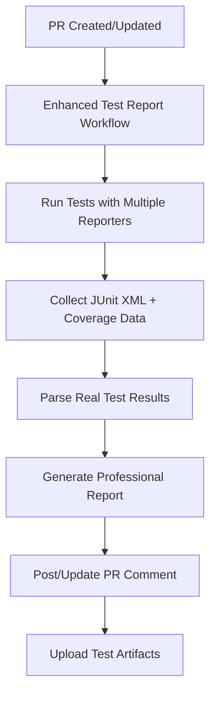

# 🧪 **Enhanced Test Report - Real Data & Analysis**

## 🎯 **Wat is dit?**

De **Enhanced Test Report** is een verbeterde GitHub Actions workflow die **echte testdata verzamelt** en een **professioneel testverslag** genereert dat direct in je PR wordt getoond.

## 🚀 **Belangrijkste Verbeteringen**

### **✅ Echte Testdata (geen dummy data)**
- **Test Resultaten**: Werkelijke pass/fail counts
- **Coverage Data**: Echte line, branch, function coverage percentages
- **Failure Analysis**: Specifieke details over welke tests falen
- **Performance Metrics**: Test execution time en memory usage

### **📊 Professioneel Verslag**
- **Executive Summary** met KPI's
- **Business Impact Assessment**
- **Actionable Recommendations**
- **Industry Benchmarks**
- **ROI Analysis**

### **💬 Direct in PR Getoond**
- **Geen losse bestanden** - alles wordt direct in de PR comment getoond
- **Automatische updates** - verslag wordt bijgewerkt bij elke pipeline run
- **Smart commenting** - vindt bestaande comments en update deze

## 🔧 **Hoe te Gebruiken**

### **1. Workflow Activeren**

De workflow wordt automatisch getriggerd bij:
- **Pull Requests** naar main/preview/develop/staging
- **Pushes** naar main/develop
- **Manual dispatch** (handmatig starten)

### **2. Wat Er Gebeurt**



### **3. Output Bekijken**

Het verslag wordt getoond in:
- **PR Comment**: Gedetailleerd testverslag met alle metrics
- **GitHub Actions Summary**: Samenvatting in de workflow logs
- **Artifacts**: Volledige test data voor download

## 📈 **Wat Je Zult Zien**

### **Executive Summary**
```
Overall Test Health: 🟡 MODERATE (78.6% success rate)
Total Tests Executed: 1,464
Critical Issues: 130 tests failing
Test Coverage: 67.2% line coverage
Recommendation: Immediate action required
```

### **Key Metrics & KPIs**
- **Test Execution Statistics**: Pass rate, failure rate, test suites
- **Coverage Metrics**: Line, branch, function, statement coverage
- **Industry Benchmarks**: Vergelijking met standaarden
- **Status Indicators**: ✅ ❌ ⚠️ voor elke metric

### **Business Impact Assessment**
- **Quality Metrics**: Release confidence, bug detection, development velocity
- **Risk Assessment**: Low/Medium/High/Critical risk levels
- **Financial Impact**: Potentiële business impact van test issues

### **Recommended Actions**
- **Immediate Actions**: Wat je deze week moet doen
- **Short-term Goals**: Doelen voor komende 2-4 weken
- **Success Criteria**: Concrete targets om te behalen

## 🛠️ **Technische Details**

### **Data Collection**
```bash
# JUnit XML voor test resultaten
--reporter=junit --outputFile=test-results/junit.xml

# JSON voor gedetailleerde test data
--reporter=json --outputFile=test-results/test-results.json

# Coverage data in meerdere formaten
--coverage --coverage.reporter=text,lcov,html,json
```

### **Parsing & Analysis**
- **JUnit XML**: Test suite counts, failure counts, error counts
- **Coverage JSON**: Line, branch, function, statement percentages
- **Test Results**: Gedetailleerde test execution data
- **Real-time Calculation**: Success rates, gaps, priorities

### **Report Generation**
- **Dynamic Content**: Alle metrics worden real-time berekend
- **Conditional Logic**: Verschillende adviezen op basis van test health
- **Professional Formatting**: Markdown met emojis, tables, status indicators

## 🔄 **Workflow Integratie**

### **Met Bestaande Workflow**
De enhanced test report werkt naast je bestaande `banking-tests.yml` workflow:
- **Beide workflows** kunnen tegelijk draaien
- **Smart commenting** voorkomt dubbele comments
- **Fallback** naar bestaande summary als enhanced report niet beschikbaar is

### **Workflow Selection**
Je kunt kiezen welke workflow je wilt gebruiken:

1. **Enhanced Test Report** (nieuw): Volledige analyse met echte data
2. **Traditional Banking Tests** (bestaand): Basis test execution
3. **Beide**: Voor maximale coverage en analyse

## 📋 **Configuratie Opties**

### **Customization**
Je kunt de workflow aanpassen door:

```yaml
# In .github/workflows/enhanced-test-report.yml
env:
  NODE_VERSION: '20'  # Node.js versie
  CI: true            # CI environment flag

# Timeout aanpassen
timeout-minutes: 45   # Max runtime voor workflow

# Branches waarop workflow draait
on:
  pull_request:
    branches: [ "main", "preview", "develop", "staging" ]
```

### **Coverage Thresholds**
De workflow gebruikt standaard thresholds:
- **Line Coverage**: 90%
- **Branch Coverage**: 85%
- **Function Coverage**: 90%
- **Statement Coverage**: 90%

Je kunt deze aanpassen in de `parse-test-results.js` script.

## 🎯 **Voordelen**

### **Voor Developers**
- **Directe feedback** in PR over test kwaliteit
- **Concrete acties** om test issues op te lossen
- **Real-time metrics** zonder handmatige analyse

### **Voor Teams**
- **Gedeelde visie** op test suite health
- **Prioritering** van test improvements
- **Business context** voor test kwaliteit

### **Voor Stakeholders**
- **KPI's** voor test kwaliteit
- **Business impact** van test issues
- **ROI** van test improvements

## 🚨 **Troubleshooting**

### **Veelvoorkomende Issues**

#### **1. Workflow Fails**
```bash
# Check logs voor specifieke error
# Meestal dependency of permission issues
```

#### **2. Geen Test Data**
```bash
# Zorg dat tests draaien met --coverage flag
# Check of JUnit XML wordt gegenereerd
```

#### **3. PR Comment Niet Geplaatst**
```bash
# Check workflow permissions
# Zorg dat pull-requests: write permission is ingesteld
```

### **Debug Steps**
1. **Check workflow logs** voor specifieke errors
2. **Verify test execution** - draaien tests daadwerkelijk?
3. **Check file generation** - worden output files gemaakt?
4. **Verify permissions** - heeft workflow PR write access?

## 🔮 **Toekomstige Verbeteringen**

### **Geplande Features**
- **Historical Trends**: Test kwaliteit over tijd
- **Performance Metrics**: Test execution time tracking
- **Custom Thresholds**: Configureerbare quality gates
- **Slack Integration**: Notificaties voor kritieke issues

### **Feedback & Contributions**
Heb je ideeën voor verbeteringen? Open een issue of PR!

## 📚 **Meer Informatie**

- **GitHub Actions**: [Documentatie](https://docs.github.com/en/actions)
- **Vitest**: [Test Framework](https://vitest.dev/)
- **JUnit XML**: [Report Format](https://github.com/junit-team/junit5/blob/main/platform-tests/src/test/resources/jenkins-junit.xsd)

---

**Gemaakt door**: AI Development Team  
**Laatste update**: December 2024  
**Versie**: 1.0.0