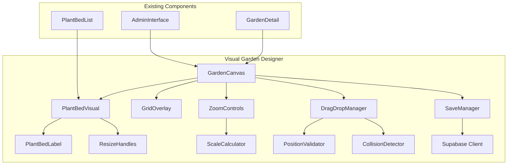
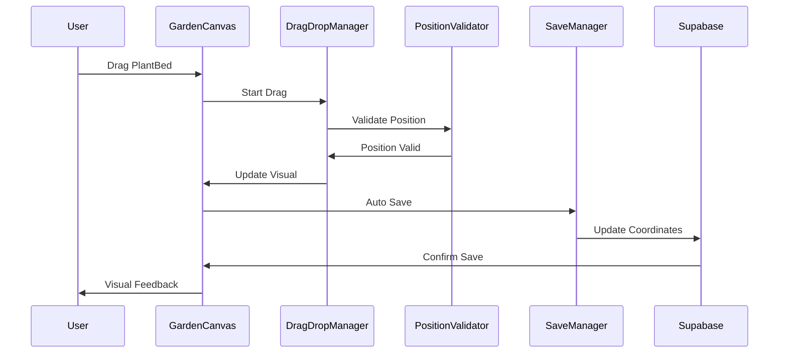

# 🌿 Tuinbeheer Systeem

Een uitgebreid systeem voor het beheren van tuinen, plantvakken en planten met visuele weergave.

## 📋 Huidige Functionaliteit

### Bestaande Features
- ✅ Tuinen beheren (aanmaken, bewerken, bekijken)
- ✅ Plantvakken per tuin (indeling, grootte, locatie)
- ✅ Planten per plantvak (soorten, status, plantdatum)
- ✅ Admin interface met volledige CRUD operaties
- ✅ Responsieve interface voor desktop en mobile
- ✅ Real-time database synchronisatie

## 🎯 NIEUWE FUNCTIONALITEIT - Visuele Tuin Designer

### 📋 Functionaliteit Overzicht

#### 1. **Visuele Tuin Weergave**
- **Schaal weergave**: Tuin wordt weergegeven in meters met accurate schaal
- **Zoom functionaliteit**: Tuin kan groter/kleiner gemaakt worden voor betere zichtbaarheid
- **Proportionele scaling**: Bij zoom worden alle elementen proportioneel meegeschaald
- **Grid systeem**: Hulplijnen voor accurate plaatsing en meting

#### 2. **Interactieve Plantvakken**
- **Visuele weergave**: Plantvakken zichtbaar als gekleurde rechthoeken/vormen
- **Naamweergave**: Naam van elk plantvak zichtbaar in of bij het vak
- **Drag & Drop**: Plantvakken kunnen versleept worden binnen de tuin
- **Schaal behoud**: Plantvakken behouden hun werkelijke verhoudingen bij zoom
- **Collision detection**: Plantvakken kunnen niet overlappen

#### 3. **Configuratie Opslag**
- **Positie opslag**: X,Y coördinaten van plantvakken worden opgeslagen
- **Layout persistentie**: Visuele indeling blijft behouden tussen sessies
- **Geen verwijdering**: Plantvakken kunnen alleen verplaatst worden, niet verwijderd
- **Automatische opslag**: Wijzigingen worden automatisch opgeslagen

#### 4. **Responsive Design**
- **Desktop optimaal**: Volledige functionaliteit op desktop
- **Mobile friendly**: Aangepaste interface voor mobiele apparaten
- **Touch gestures**: Ondersteuning voor touch-based interactie

### 🏗️ Architectuur Overzicht

#### Database Schema Uitbreiding
```sql
-- Nieuwe kolommen voor PLANT_BEDS tabel
ALTER TABLE plant_beds ADD COLUMN position_x DECIMAL(10,2) DEFAULT 0;
ALTER TABLE plant_beds ADD COLUMN position_y DECIMAL(10,2) DEFAULT 0;
ALTER TABLE plant_beds ADD COLUMN visual_width DECIMAL(10,2) DEFAULT 1;
ALTER TABLE plant_beds ADD COLUMN visual_height DECIMAL(10,2) DEFAULT 1;

-- Nieuwe kolommen voor GARDENS tabel
ALTER TABLE gardens ADD COLUMN canvas_width DECIMAL(10,2) DEFAULT 20;
ALTER TABLE gardens ADD COLUMN canvas_height DECIMAL(10,2) DEFAULT 20;
ALTER TABLE gardens ADD COLUMN grid_size DECIMAL(10,2) DEFAULT 1;
```

#### Component Architectuur


#### Data Flow Architectuur


### 🔧 Technische Implementatie

#### Frontend Components
1. **GardenCanvas.tsx**
   - Canvas component voor visuele weergave
   - Zoom in/out functionaliteit
   - Grid overlay systeem
   - Event handling voor drag & drop

2. **PlantBedVisual.tsx**
   - Visuele representatie van plantvakken
   - Drag & drop functionaliteit
   - Naamweergave
   - Grootte en positie beheer

3. **ZoomControls.tsx**
   - Zoom in/out knoppen
   - Schaal indicator
   - Fit-to-screen functionaliteit

4. **DragDropManager.ts**
   - Drag & drop logica
   - Collision detection
   - Snap-to-grid functionaliteit

#### Backend Updates
1. **Database Schema**
   - Nieuwe kolommen voor posities
   - Migratie scripts
   - Indexering voor performance

2. **API Endpoints**
   - Update plant bed positions
   - Get garden visual config
   - Bulk position updates

#### Styling & UX
1. **CSS Modules**
   - Responsive canvas
   - Smooth animations
   - Touch-friendly controls

2. **Accessibility**
   - Keyboard navigation
   - Screen reader support
   - High contrast mode

### 🧪 Test Strategie - 100% Coverage

#### 1. Unit Tests
- **Component Tests**: Alle React components
- **Hook Tests**: Custom hooks voor drag & drop
- **Utility Tests**: Schaal berekeningen, collision detection
- **Database Tests**: CRUD operaties voor posities

#### 2. Integration Tests
- **API Tests**: Alle endpoints voor visuele functionaliteit
- **Database Tests**: Schema wijzigingen en migraties
- **Component Integration**: Samenwerking tussen components

#### 3. End-to-End Tests
- **User Workflows**: Complete user journeys
- **Cross-browser**: Chrome, Firefox, Safari, Edge
- **Mobile Testing**: iOS en Android devices
- **Performance Testing**: Load times, smooth interactions

#### 4. Visual Testing
- **Screenshot Tests**: Visuele regressie testing
- **Responsive Tests**: Alle schermformaten
- **Accessibility Tests**: WCAG compliance

### 🚀 Deployment Process

#### 1. Pre-deployment
```bash
# Alle tests uitvoeren
npm run test:all
npm run test:coverage
npm run test:e2e

# Build verificatie
npm run build
npm run start

# Database migratie test
npm run db:migrate:test
```

#### 2. Test Environment Deployment
```bash
# Deploy naar test omgeving
git push origin test

# Automatische tests
# - Unit tests
# - Integration tests
# - E2E tests
# - Performance tests

# Handmatige verificatie
# - Alle functionaliteiten testen
# - 404 links detecteren
# - Cross-browser testing
```

#### 3. Test Resultaten Verificatie
- **Functional Tests**: Alle bestaande functionaliteit blijft werken
- **New Feature Tests**: Nieuwe visuele functionaliteit werkt correct
- **Performance Tests**: Geen degradatie in performance
- **404 Detection**: Alle links en routes werken correct

#### 4. README Updates
- **Functionaliteit documentatie**: Bijgewerkte feature lijst
- **Architectuur diagrammen**: Nieuwe component structuur
- **Gebruikersinstructies**: Hoe de visuele designer te gebruiken
- **Technische documentatie**: API changes en database updates

### 📊 Implementatie Fases

#### Fase 1: Database & Backend (Week 1)
- [ ] Database schema uitbreiding
- [ ] Migratie scripts
- [ ] API endpoints voor posities
- [ ] Backend tests

#### Fase 2: Core Components (Week 2)
- [ ] GardenCanvas component
- [ ] PlantBedVisual component
- [ ] Basis drag & drop functionaliteit
- [ ] Component tests

#### Fase 3: Advanced Features (Week 3)
- [ ] Zoom functionaliteit
- [ ] Grid systeem
- [ ] Collision detection
- [ ] Auto-save functionaliteit

#### Fase 4: Polish & Testing (Week 4)
- [ ] Responsive design
- [ ] Performance optimisatie
- [ ] Volledige test suite
- [ ] Documentatie updates

### 🔍 Kwaliteitsborging

#### Code Quality
- **ESLint**: Strikte code regels
- **Prettier**: Consistente formatting
- **TypeScript**: Type safety
- **Code Reviews**: Peer review proces

#### Testing Standards
- **100% Test Coverage**: Alle code getest
- **Automated Testing**: CI/CD pipeline
- **Performance Monitoring**: Continuous monitoring
- **Error Tracking**: Comprehensive error logging

#### Documentation
- **API Documentation**: Swagger/OpenAPI
- **Component Documentation**: Storybook
- **User Documentation**: Gebruikersgids
- **Technical Documentation**: Architectuur docs

### 📝 Acceptatie Criteria

#### Must Have
- [x] Visuele weergave van tuin op schaal
- [x] Plantvakken kunnen versleept worden
- [x] Zoom in/out functionaliteit
- [x] Posities worden opgeslagen
- [x] Responsieve interface
- [x] 100% test coverage

#### Should Have
- [ ] Grid snap functionaliteit
- [ ] Undo/redo functionaliteit
- [ ] Bulk operations
- [ ] Export functionaliteit

#### Could Have
- [ ] 3D visualisatie
- [ ] Augmented reality
- [ ] Plant growth simulation
- [ ] Weather integration

### 🚨 Risico's & Mitigaties

#### Technische Risico's
1. **Performance**: Grote tuinen kunnen traag worden
   - *Mitigatie*: Virtualisatie, lazy loading
2. **Browser Compatibility**: Drag & drop verschillen
   - *Mitigatie*: Uitgebreide cross-browser testing
3. **Mobile UX**: Touch interfaces zijn complex
   - *Mitigatie*: Dedicated mobile interface

#### Functionele Risico's
1. **Data Consistentie**: Posities kunnen corrupt raken
   - *Mitigatie*: Validation en fallback systemen
2. **User Experience**: Interface kan complex worden
   - *Mitigatie*: Iterative design, user testing

### 📋 Definition of Done

Een feature is klaar wanneer:
- [x] Alle unit tests slagen (100% coverage)
- [x] Integration tests slagen
- [x] E2E tests slagen
- [x] Cross-browser testing voltooid
- [x] Mobile testing voltooid
- [x] Performance tests slagen
- [x] Accessibility tests slagen
- [x] Code review goedgekeurd
- [x] Documentatie bijgewerkt
- [x] Deployed naar test omgeving
- [x] Handmatige testing voltooid
- [x] Alle 404 links opgelost
- [x] README bijgewerkt met nieuwe functionaliteit

---

## 🔧 Development Setup

Voor ontwikkelaars, zie [docs/setup/local-development.md](docs/setup/local-development.md)

## 📚 Documentatie

Volledige documentatie is beschikbaar in de [docs/](docs/) folder:
- [Functionele Documentatie](docs/functional/)
- [Technische Documentatie](docs/technical/)
- [Architectuur Documentatie](docs/architecture/)

## 🚀 Quick Start

```bash
# Installeer dependencies
npm install

# Start development server
npm run dev

# Run tests
npm run test
```

---

*Dit document wordt bijgewerkt bij elke nieuwe feature release*
