# 🚀 Banking-Grade CI/CD Pipeline Setup

Deze documentatie beschrijft hoe je CI/CD pipeline is geconfigureerd om automatisch te voldoen aan de hoogste kwaliteitsstandaarden zonder mogelijkheid tot overruling.

## 🎯 Overzicht

De CI/CD pipeline is ontworpen om **automatisch** te zorgen dat alle code voldoet aan de vereiste standaarden voordat deze naar preview of productie wordt gedeployed. Er is **geen mogelijkheid** om deze checks te omzeilen of over te rulen.

## 🔒 Quality Gates (Geen Override Mogelijk)

### 1. Code Quality Gates
- **ESLint**: Code style en kwaliteit (CRITICAL - geen override)
- **TypeScript**: Type safety validatie (CRITICAL - geen override)
- **Jest Tests**: Unit en integratie tests (CRITICAL - geen override)
- **Coverage Thresholds**: Test coverage validatie (CRITICAL - geen override)

### 2. Security Gates
- **Security Audit**: NPM security vulnerabilities (CRITICAL - geen override)
- **Banking Standards**: Compliance checks (CRITICAL - geen override)
- **Dependency Check**: Known vulnerabilities scan

### 3. Build Gates
- **Build Validation**: Applicatie build (CRITICAL - geen override)
- **Size Check**: Build output validatie
- **Bundle Analysis**: Optionele bundle optimalisatie

### 4. Documentation Gates
- **README Check**: Documentatie aanwezigheid
- **Cursor Rules**: Development guidelines
- **TODO Check**: Openstaande taken identificatie

## 🚫 Preview Deployment Blokkering

**PR's worden AUTOMATISCH geblokkeerd voor preview deployment als:**

```yaml
# Preview deployment wordt alleen uitgevoerd als:
if: |
  (needs.changes.outputs.code == 'true' || github.event_name == 'pull_request') &&
  github.event_name == 'pull_request' &&
  needs.quality.result == 'success' &&      # ✅ Alle quality gates moeten slagen
  needs.security.result == 'success' &&     # ✅ Alle security checks moeten slagen
  needs.build.result == 'success' &&        # ✅ Build moet slagen
  secrets.VERCEL_TOKEN != ''
```

## 🔐 Branch Protection Rules

### Main Branch (Production)
- **2 code reviews vereist**
- **Code owner review vereist**
- **Alle CI/CD checks moeten slagen**
- **Geen force push toegestaan**
- **Conversatie resolutie vereist**

### Develop Branch (Staging)
- **1 code review vereist**
- **Alle CI/CD checks moeten slagen**
- **Geen force push toegestaan**
- **Conversatie resolutie vereist**

### Feature Branches
- **1 code review vereist**
- **Quality, Security, Build checks vereist**
- **Force push toegestaan (development)**

### Hotfix Branches
- **2 code reviews vereist**
- **Code owner review vereist**
- **Alle critical checks vereist**
- **Geen force push toegestaan**

## 🛠️ Automatische Setup

### 1. Branch Protection Script

```bash
# Installeer vereisten
sudo apt-get install jq

# Configureer environment variables
export GITHUB_TOKEN="your_github_token"
export GITHUB_REPOSITORY="username/repository"

# Voer het script uit
./scripts/setup-branch-protection.sh
```

### 2. GitHub UI Setup (Pattern Branches)

Voor `feature/*` en `hotfix/*` branches moet je handmatig de pattern protection instellen:

1. Ga naar **Settings > Branches**
2. Klik op **Add rule**
3. Voer pattern in: `feature/*`
4. Configureer:
   - ✅ Require status checks to pass before merging
   - ✅ Require branches to be up to date before merging
   - ✅ Require pull request reviews before merging
   - ✅ Dismiss stale pull request approvals when new commits are pushed
   - ✅ Require review from code owners
   - ✅ Allow force pushes
   - ✅ Allow deletions

Herhaal voor `hotfix/*` (maar zonder force push toegestaan).

## 📊 Pipeline Flow

```mermaid
graph TD
    A[PR Created] --> B[Change Detection]
    B --> C[Quality Gates]
    B --> D[Security Checks]
    B --> E[Build Validation]
    B --> F[Documentation Check]
    
    C --> G{All Tests Pass?}
    D --> H{All Security OK?}
    E --> I{Build Success?}
    F --> J{Docs OK?}
    
    G -->|❌| K[Preview BLOCKED]
    H -->|❌| K
    I -->|❌| K
    J -->|❌| K
    
    G -->|✅| L[Preview Ready]
    H -->|✅| L
    I -->|✅| L
    J -->|✅| L
    
    L --> M[Deploy to Preview]
    M --> N[PR Available for Review]
```



## 🚨 Error Handling

### Test Failures
```bash
❌ CRITICAL: Tests failed with exit code 1
🔒 Preview deployment will NOT be triggered
📋 Please fix all issues and push again
```

### Security Violations
```bash
❌ CRITICAL: Hardcoded credentials found!
🔒 Preview deployment will NOT be triggered
📋 Please remove hardcoded values and use environment variables
```

### Build Failures
```bash
❌ CRITICAL: Build failed!
🔒 Preview deployment will NOT be triggered
📋 Please fix build issues and push again
```

## 🔧 Troubleshooting

### Pipeline Hangs
1. Check GitHub Actions tab
2. Verify all required secrets are set
3. Check branch protection rules
4. Ensure all required status checks are configured

### Tests Failing
1. Run tests locally: `npm run test:ci`
2. Check coverage thresholds in `jest.config.js`
3. Verify all dependencies are installed
4. Check for TypeScript errors: `npm run type-check`

### Security Issues
1. Run security audit: `npm run audit:security`
2. Update vulnerable dependencies
3. Check for hardcoded credentials
4. Verify environment variable usage

## 📈 Monitoring & Metrics

### Code Coverage
- **Minimum threshold**: 80%
- **Enforced in**: Jest configuratie
- **Reported to**: Codecov (optioneel)

### Build Performance
- **Build time tracking**
- **Bundle size monitoring**
- **Performance regression detection**

### Security Metrics
- **Vulnerability count tracking**
- **Dependency update frequency**
- **Compliance violation history**

## 🎉 Voordelen van deze Setup

1. **🔒 Geen Override Mogelijk**: Alle checks zijn verplicht
2. **🚀 Automatische Deployment**: Preview wordt automatisch gedeployed bij succes
3. **🛡️ Consistentie**: Alle code voldoet aan dezelfde standaarden
4. **📊 Transparantie**: Duidelijke feedback over wat er mis is
5. **⚡ Snelheid**: Geen handmatige checks nodig
6. **🔍 Compliance**: Automatische banking standards validatie

## 🚀 Volgende Stappen

1. **Configureer branch protection rules** met het script
2. **Stel pattern-based protection** in voor feature/hotfix branches
3. **Test de pipeline** met een kleine PR
4. **Monitor de resultaten** in GitHub Actions
5. **Pas thresholds aan** indien nodig

---

**⚠️ Belangrijk**: Deze pipeline is ontworpen om **NIET** overruled te kunnen worden. Alle quality gates moeten slagen voordat deployment mogelijk is. Dit zorgt ervoor dat je code altijd voldoet aan de hoogste standaarden.