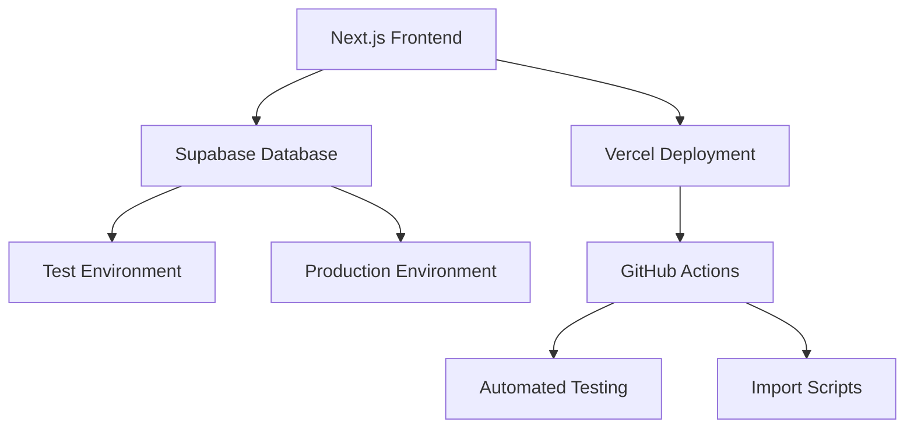

# 🌿 Tuinbeheer Systeem - Documentatie Overzicht

## 📋 Inhoudsopgave

### 🎯 [Functionele Documentatie](./functional/README.md)
- [Systeembeschrijving](./functional/system-description.md)
- [Gebruikershandleiding](./functional/user-guide.md)
- [Functionaliteiten](./functional/features.md)
- [Workflows](./functional/workflows.md)

### 🔧 [Technische Documentatie](./technical/README.md)
- [Architectuur Overzicht](./technical/architecture-overview.md)
- [Database Schema](./technical/database-schema.md)
- [API Documentatie](./technical/api-documentation.md)
- [Ontwikkelaar Gids](./technical/developer-guide.md)

### 🏗️ [Architectuur Documentatie](./architecture/README.md)
- [Systeem Architectuur](./architecture/system-architecture.md)
- [Database Architectuur](./architecture/database-architecture.md)
- [Deployment Architectuur](./architecture/deployment-architecture.md)
- [Veiligheid & Compliance](./architecture/security-compliance.md)

### 🚀 [Deployment Documentatie](./deployment/README.md)
- [Deployment Gids](./deployment/deployment-guide.md)
- [Environment Setup](./deployment/environment-setup.md)
- [Monitoring & Logging](./deployment/monitoring-logging.md)
- [Troubleshooting](./deployment/troubleshooting.md)

### ⚙️ [Setup & Installatie](./setup/README.md)
- [Quick Start](./setup/quick-start.md)
- [Lokale Ontwikkeling](./setup/local-development.md)
- [Database Setup](./setup/database-setup.md)
- [Import Scripts](./setup/import-scripts.md)

---

## 🚀 Quick Start

Voor een snelle start:

1. **Lokale ontwikkeling**: [`docs/setup/local-development.md`](./setup/local-development.md)
2. **Database setup**: [`docs/setup/database-setup.md`](./setup/database-setup.md)
3. **Deployment**: [`docs/deployment/deployment-guide.md`](./deployment/deployment-guide.md)

## 📊 Systeem Overzicht

## 🎯 Doelgroepen

- **🔧 Ontwikkelaars**: Technische documentatie en API referenties
- **👥 Eindgebruikers**: Functionele documentatie en gebruikershandleidingen
- **🏗️ Architecten**: Systeem architectuur en design patterns
- **🚀 DevOps**: Deployment en configuratie gidsen

## 📝 Documentatie Onderhoud

Deze documentatie wordt automatisch bijgewerkt bij elke release. Voor wijzigingen zie [CONTRIBUTING.md](../CONTRIBUTING.md).

---
*Laatst bijgewerkt: $(date "+%Y-%m-%d")*