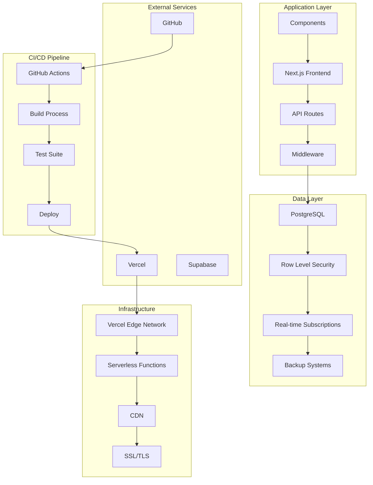
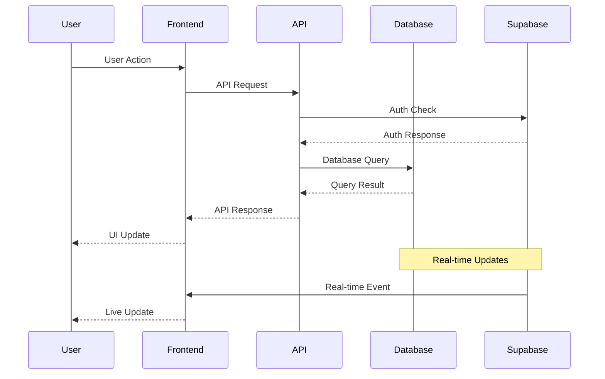
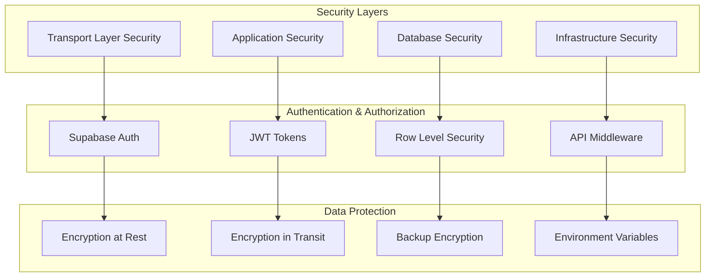

# 🏗️ Architectuur Documentatie

## Overzicht

Deze sectie beschrijft de architecturale aspecten van het Tuinbeheer Systeem voor architecten en senior developers.

## 📋 Inhoud

### [Systeem Architectuur](./system-architecture.md)
High-level systeem architectuur, design patterns en principes.

### [Database Architectuur](./database-architecture.md)
Database design, normalisatie en performance overwegingen.

### [Deployment Architectuur](./deployment-architecture.md)
Infrastructure, CI/CD pipelines en environment management.

### [Veiligheid & Compliance](./security-compliance.md)
Security architecture, compliance en privacy overwegingen.

## 🎯 Architectuur Principes

### 1. **Modulairiteit**
- Component-based architecture
- Loose coupling, high cohesion
- Herbruikbare componenten

### 2. **Schaalbaarheid**
- Serverless architecture
- Database performance optimalisatie
- Caching strategieën

### 3. **Beveiliging**
- Zero-trust security model
- End-to-end encryption
- Principle of least privilege

### 4. **Onderhoudbaarheid**
- Clean code principles
- Geautomatiseerde testing
- Continuous integration

## 🏗️ High-Level Architectuur

## 🔄 Data Flow Architecture

## 🛡️ Security Architecture

## 📊 Performance Architecture

### Caching Strategy
- **Static Assets**: Vercel Edge CDN
- **API Responses**: Server-side caching
- **Database Queries**: Connection pooling
- **Real-time Data**: Supabase subscriptions

### Monitoring & Observability
- **Application Metrics**: Vercel Analytics
- **Database Performance**: Supabase Dashboard
- **Error Tracking**: Built-in logging
- **User Analytics**: Privacy-first metrics

## 🚀 Deployment Strategy

### Environments
- **Test**: `test` branch → Test database
- **Production**: `main` branch → Production database

### CI/CD Pipeline
1. **Code Push** → GitHub
2. **Automated Tests** → GitHub Actions
3. **Build Process** → Vercel
4. **Deployment** → Vercel Edge Network
5. **Health Checks** → Automated monitoring

## 📈 Scaling Considerations

### Horizontal Scaling
- Serverless functions auto-scale
- Database connection pooling
- CDN distribution

### Vertical Scaling
- Database resource allocation
- Function memory optimization
- Cache layer improvements