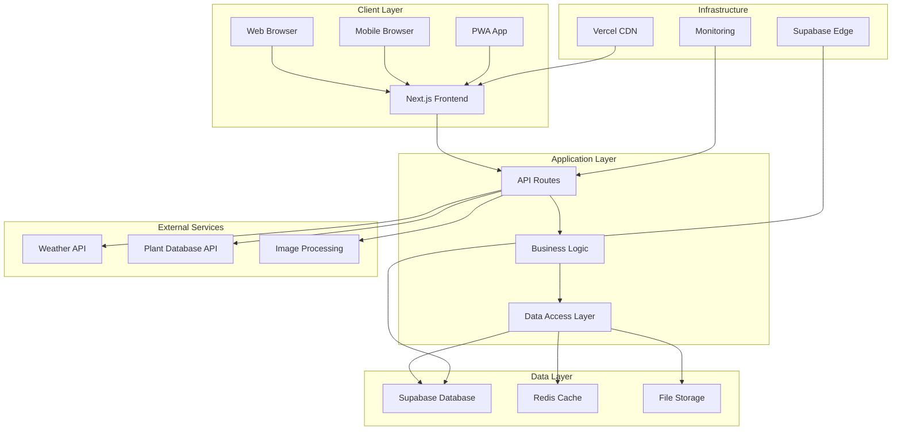
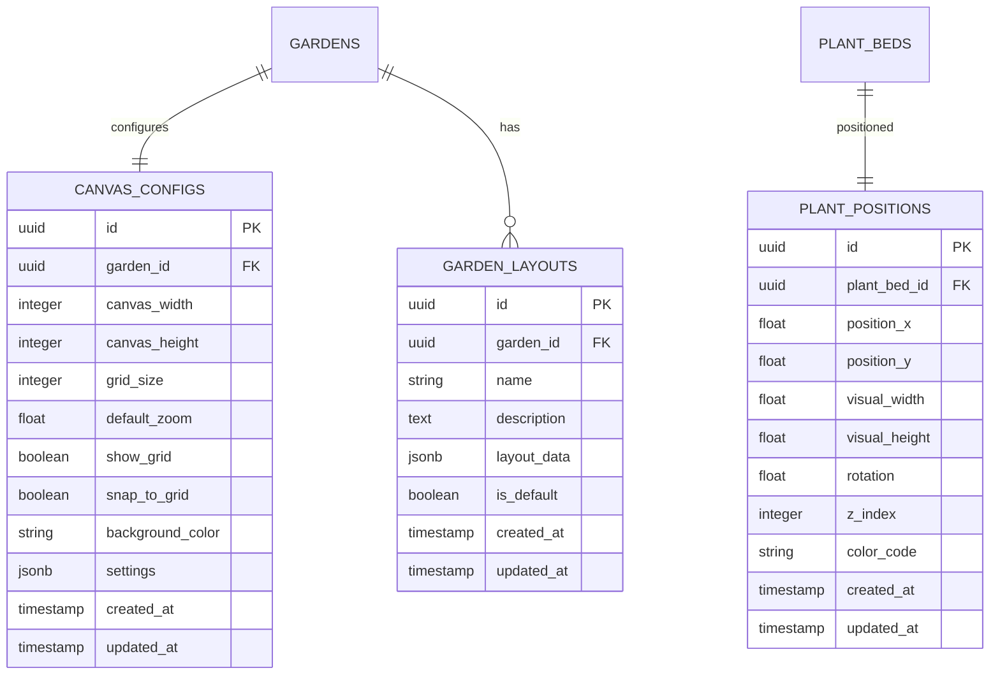

# 🏗️ System Architecture - Tuinbeheer Systeem

Comprehensive architecture documentation for technical leads and system architects.

## 📚 Table of Contents

1. [Architecture Overview](#architecture-overview)
2. [System Components](#system-components)
3. [Technology Stack](#technology-stack)
4. [Database Architecture](#database-architecture)
5. [API Architecture](#api-architecture)
6. [Frontend Architecture](#frontend-architecture)
7. [Security Architecture](#security-architecture)
8. [Performance & Scalability](#performance--scalability)
9. [Deployment Architecture](#deployment-architecture)
10. [Monitoring & Observability](#monitoring--observability)

---

## 🎯 Architecture Overview

### System Purpose
The Tuinbeheer Systeem is a modern, cloud-native garden management platform designed to provide:
- **Interactive garden planning** through visual canvas-based design
- **Comprehensive plant management** with Dutch plant database integration
- **Real-time collaboration** for shared garden spaces
- **Mobile-first responsive design** for on-site usage
- **Scalable architecture** supporting growth from individual to enterprise use

### Architecture Principles

#### 1. **Modularity**
- Loosely coupled components
- Clear separation of concerns
- Independent deployable modules
- Service-oriented design patterns

#### 2. **Scalability**
- Horizontal scaling capabilities
- Stateless application design
- Database optimization for read/write patterns
- CDN integration for static assets

#### 3. **Performance**
- Client-side caching strategies
- Database query optimization
- Lazy loading and code splitting
- Progressive Web App (PWA) features

#### 4. **Security**
- Zero-trust security model
- End-to-end encryption
- Role-based access control (RBAC)
- OWASP compliance

#### 5. **Maintainability**
- Clean architecture patterns
- Comprehensive documentation
- Automated testing strategies
- CI/CD pipeline integration

---

## 🔧 System Components

### High-Level Architecture



### Component Breakdown

#### 1. **Frontend Layer**
- **Next.js 14**: React-based framework with App Router
- **TypeScript**: Type-safe development
- **Tailwind CSS**: Utility-first styling
- **shadcn/ui**: Accessible component library
- **Canvas API**: Interactive garden visualization

#### 2. **API Layer**
- **Next.js API Routes**: RESTful API endpoints
- **Serverless Functions**: Scalable request handling
- **Middleware**: Authentication, validation, logging
- **Route Handlers**: Type-safe request/response handling

#### 3. **Data Layer**
- **Supabase PostgreSQL**: Primary database
- **Real-time Subscriptions**: Live data synchronization
- **Row-Level Security**: Fine-grained access control
- **Edge Functions**: Database-level business logic

#### 4. **External Integrations**
- **Weather Services**: Climate data for plant care
- **Plant Database**: Dutch flora information
- **Image Processing**: Photo optimization and storage
- **Authentication**: Social login providers

---

## 🛠️ Technology Stack

### Frontend Technologies

| Technology | Version | Purpose | Rationale |
|------------|---------|---------|-----------|
| **Next.js** | 14.x | React Framework | SSR/SSG, API routes, performance optimization |
| **React** | 18.x | UI Library | Component-based architecture, ecosystem |
| **TypeScript** | 5.x | Type Safety | Development productivity, runtime safety |
| **Tailwind CSS** | 3.x | Styling | Utility-first, responsive design |
| **shadcn/ui** | Latest | UI Components | Accessible, customizable components |
| **Lucide React** | Latest | Icons | Consistent, scalable icon system |
| **Framer Motion** | Latest | Animations | Smooth interactions and transitions |

### Backend Technologies

| Technology | Version | Purpose | Rationale |
|------------|---------|---------|-----------|
| **Supabase** | Latest | Database & Auth | PostgreSQL, real-time, managed service |
| **PostgreSQL** | 15.x | Database | ACID compliance, JSON support, scalability |
| **Prisma** | 5.x | ORM | Type-safe database access, migrations |
| **Redis** | 7.x | Caching | Session storage, performance optimization |
| **Node.js** | 18.x | Runtime | JavaScript runtime, NPM ecosystem |

### DevOps & Infrastructure

| Technology | Version | Purpose | Rationale |
|------------|---------|---------|-----------|
| **Vercel** | Latest | Deployment | Serverless, CDN, Next.js optimization |
| **Docker** | Latest | Containerization | Consistent environments, scalability |
| **GitHub Actions** | Latest | CI/CD | Automated testing, deployment |
| **Sentry** | Latest | Monitoring | Error tracking, performance monitoring |
| **Lighthouse** | Latest | Performance | Web vitals, accessibility auditing |

---

## 🗄️ Database Architecture

### Database Schema Design

#### Core Entity Model

```mermaid
erDiagram
    GARDENS {
        uuid id PK
        string name
        text description
        jsonb metadata
        integer canvas_width
        integer canvas_height
        integer grid_size
        float default_zoom
        boolean show_grid
        boolean snap_to_grid
        string background_color
        timestamp created_at
        timestamp updated_at
    }
    
    PLANT_BEDS {
        uuid id PK
        uuid garden_id FK
        string name
        float length
        float width
        float position_x
        float position_y
        float visual_width
        float visual_height
        float rotation
        integer z_index
        string color_code
        boolean is_active
        timestamp created_at
        timestamp updated_at
        timestamp visual_updated_at
    }
    
    PLANTS {
        uuid id PK
        uuid plant_bed_id FK
        string name
        string scientific_name
        string plant_type
        string variety
        float height
        float spread
        string color
        string season
        text care_instructions
        date planting_date
        date expected_harvest
        string status
        jsonb metadata
        timestamp created_at
        timestamp updated_at
    }
    
    PLANT_PHOTOS {
        uuid id PK
        uuid plant_id FK
        string url
        string caption
        string photo_type
        jsonb metadata
        timestamp created_at
    }
    
    GARDENS ||--o{ PLANT_BEDS : contains
    PLANT_BEDS ||--o{ PLANTS : contains
    PLANTS ||--o{ PLANT_PHOTOS : has
```



#### Visual Garden Designer Schema



### Database Optimization

#### Indexing Strategy

```sql
-- Primary indexes for performance
CREATE INDEX idx_plant_beds_garden_id ON plant_beds(garden_id);
CREATE INDEX idx_plants_plant_bed_id ON plants(plant_bed_id);
CREATE INDEX idx_plant_photos_plant_id ON plant_photos(plant_id);

-- Composite indexes for complex queries
CREATE INDEX idx_plant_beds_garden_position ON plant_beds(garden_id, position_x, position_y);
CREATE INDEX idx_plants_status_date ON plants(status, created_at);
CREATE INDEX idx_plants_type_season ON plants(plant_type, season);

-- Partial indexes for performance
CREATE INDEX idx_active_plant_beds ON plant_beds(garden_id) WHERE is_active = true;
CREATE INDEX idx_recent_plants ON plants(plant_bed_id, created_at) WHERE created_at > NOW() - INTERVAL '30 days';

-- Full-text search indexes
CREATE INDEX idx_plants_search ON plants USING gin(to_tsvector('english', name || ' ' || COALESCE(scientific_name, '')));
```

#### Performance Optimization

```sql
-- Materialized views for complex queries
CREATE MATERIALIZED VIEW garden_statistics AS
SELECT 
    g.id as garden_id,
    g.name as garden_name,
    COUNT(pb.id) as plant_bed_count,
    COUNT(p.id) as plant_count,
    SUM(pb.length * pb.width) as total_area,
    AVG(CASE WHEN p.status = 'healthy' THEN 1 ELSE 0 END) as health_score
FROM gardens g
LEFT JOIN plant_beds pb ON g.id = pb.garden_id
LEFT JOIN plants p ON pb.id = p.plant_bed_id
GROUP BY g.id, g.name;

-- Refresh materialized view trigger
CREATE OR REPLACE FUNCTION refresh_garden_statistics()
RETURNS TRIGGER AS $$
BEGIN
    REFRESH MATERIALIZED VIEW garden_statistics;
    RETURN NULL;
END;
$$ LANGUAGE plpgsql;

-- Triggers for automatic refresh
CREATE TRIGGER refresh_stats_on_plant_change
    AFTER INSERT OR UPDATE OR DELETE ON plants
    FOR EACH STATEMENT
    EXECUTE FUNCTION refresh_garden_statistics();
```

---

## 🔌 API Architecture

### API Design Principles

#### 1. **RESTful Design**
- Resource-based URLs
- HTTP methods for operations
- Consistent response formats
- Proper status codes

#### 2. **Type Safety**
- TypeScript interfaces
- Runtime validation
- Error handling
- Request/response schemas

#### 3. **Performance**
- Pagination for large datasets
- Caching strategies
- Rate limiting
- Request optimization

### API Endpoints Structure

```typescript
// Garden Management API
GET    /api/gardens                    // List all gardens
POST   /api/gardens                    // Create new garden
GET    /api/gardens/:id                // Get garden details
PUT    /api/gardens/:id                // Update garden
DELETE /api/gardens/:id                // Delete garden

// Plant Bed Management API
GET    /api/plant-beds                 // List plant beds
POST   /api/plant-beds                 // Create plant bed
GET    /api/plant-beds/:id             // Get plant bed details
PUT    /api/plant-beds/:id             // Update plant bed
DELETE /api/plant-beds/:id             // Delete plant bed
PUT    /api/plant-beds/:id/position    // Update position

// Plant Management API
GET    /api/plants                     // List plants
POST   /api/plants                     // Create plant
GET    /api/plants/:id                 // Get plant details
PUT    /api/plants/:id                 // Update plant
DELETE /api/plants/:id                 // Delete plant
POST   /api/plants/:id/photos          // Upload photos

// Visual Garden Designer API
GET    /api/visual-garden/:gardenId    // Get garden layout
PUT    /api/visual-garden/:gardenId    // Update garden layout
POST   /api/visual-garden/:gardenId/save // Save layout
GET    /api/visual-garden/:gardenId/export // Export layout

// Plant Database API
GET    /api/plant-database/search      // Search plants
GET    /api/plant-database/:id         // Get plant details
GET    /api/plant-database/categories  // Get plant categories
```

### API Response Format

```typescript
// Standard API Response Interface
interface ApiResponse<T> {
  success: boolean;
  data: T | null;
  error?: {
    code: string;
    message: string;
    details?: any;
  };
  metadata?: {
    total: number;
    page: number;
    limit: number;
    hasNext: boolean;
    hasPrev: boolean;
  };
}

// Example Usage
const response: ApiResponse<Garden[]> = {
  success: true,
  data: [
    {
      id: "123e4567-e89b-12d3-a456-426614174000",
      name: "Front Garden",
      description: "Beautiful flower garden",
      canvas_width: 20,
      canvas_height: 15,
      created_at: "2024-01-01T00:00:00Z",
      updated_at: "2024-01-01T00:00:00Z"
    }
  ],
  metadata: {
    total: 1,
    page: 1,
    limit: 10,
    hasNext: false,
    hasPrev: false
  }
};
```

### Authentication & Authorization

```typescript
// JWT Token Structure
interface JWTPayload {
  sub: string;        // User ID
  email: string;      // User email
  role: string;       // User role
  gardens: string[];  // Accessible garden IDs
  exp: number;        // Expiration time
  iat: number;        // Issued at time
}

// Authorization Middleware
export async function authMiddleware(req: NextRequest) {
  const token = req.headers.get('Authorization')?.replace('Bearer ', '');
  
  if (!token) {
    return new Response('Unauthorized', { status: 401 });
  }
  
  try {
    const payload = await verifyJWT(token);
    req.user = payload;
    return NextResponse.next();
  } catch (error) {
    return new Response('Invalid token', { status: 401 });
  }
}

// Role-based Access Control
export function requireRole(roles: string[]) {
  return (req: NextRequest) => {
    const user = req.user;
    if (!user || !roles.includes(user.role)) {
      return new Response('Forbidden', { status: 403 });
    }
    return NextResponse.next();
  };
}
```

---

## 🎨 Frontend Architecture

### Component Architecture

#### 1. **Atomic Design Pattern**

```
src/
├── components/
│   ├── atoms/              # Basic building blocks
│   │   ├── Button/
│   │   ├── Input/
│   │   ├── Icon/
│   │   └── Typography/
│   ├── molecules/          # Simple component groups
│   │   ├── SearchBox/
│   │   ├── PlantCard/
│   │   ├── FormField/
│   │   └── NavigationItem/
│   ├── organisms/          # Complex components
│   │   ├── Header/
│   │   ├── PlantBedList/
│   │   ├── VisualDesigner/
│   │   └── PlantForm/
│   ├── templates/          # Page layouts
│   │   ├── DashboardLayout/
│   │   ├── GardenLayout/
│   │   └── DesignerLayout/
│   └── pages/              # Complete pages
│       ├── HomePage/
│       ├── GardenPage/
│       └── DesignerPage/
```

#### 2. **State Management Architecture**

```typescript
// Global State Structure
interface AppState {
  user: UserState;
  gardens: GardenState;
  plantBeds: PlantBedState;
  plants: PlantState;
  visualDesigner: DesignerState;
  ui: UIState;
}

// Example State Slice
interface GardenState {
  gardens: Garden[];
  currentGarden: Garden | null;
  loading: boolean;
  error: string | null;
  filters: {
    search: string;
    type: string;
    sortBy: string;
  };
}

// Custom Hooks for State Management
export function useGardens() {
  const [state, setState] = useState<GardenState>(initialState);
  
  const loadGardens = async () => {
    setState(prev => ({ ...prev, loading: true }));
    try {
      const gardens = await api.gardens.getAll();
      setState(prev => ({ ...prev, gardens, loading: false }));
    } catch (error) {
      setState(prev => ({ ...prev, error: error.message, loading: false }));
    }
  };
  
  return { state, loadGardens };
}
```

### Visual Garden Designer Architecture

```typescript
// Canvas System Architecture
interface CanvasSystem {
  renderer: CanvasRenderer;
  inputHandler: InputHandler;
  stateManager: CanvasStateManager;
  eventBus: EventBus;
}

// Canvas Components
class CanvasRenderer {
  private ctx: CanvasRenderingContext2D;
  private camera: Camera;
  private layers: RenderLayer[];
  
  public render(objects: DrawableObject[]) {
    this.clearCanvas();
    this.layers.forEach(layer => layer.render(this.ctx, objects));
  }
}

class InputHandler {
  private canvas: HTMLCanvasElement;
  private eventBus: EventBus;
  
  public setupEventListeners() {
    this.canvas.addEventListener('mousedown', this.handleMouseDown);
    this.canvas.addEventListener('mousemove', this.handleMouseMove);
    this.canvas.addEventListener('mouseup', this.handleMouseUp);
    this.canvas.addEventListener('wheel', this.handleWheel);
  }
}

// Plant Bed Visual Component
interface PlantBedVisual {
  id: string;
  position: Position;
  size: Size;
  rotation: number;
  color: string;
  selected: boolean;
  dragging: boolean;
  zIndex: number;
}

class PlantBedRenderer {
  public render(ctx: CanvasRenderingContext2D, plantBed: PlantBedVisual) {
    ctx.save();
    ctx.translate(plantBed.position.x, plantBed.position.y);
    ctx.rotate(plantBed.rotation);
    
    // Draw plant bed rectangle
    ctx.fillStyle = plantBed.color;
    ctx.fillRect(-plantBed.size.width / 2, -plantBed.size.height / 2, 
                 plantBed.size.width, plantBed.size.height);
    
    // Draw selection highlight
    if (plantBed.selected) {
      ctx.strokeStyle = '#3b82f6';
      ctx.lineWidth = 2;
      ctx.strokeRect(-plantBed.size.width / 2, -plantBed.size.height / 2, 
                     plantBed.size.width, plantBed.size.height);
    }
    
    ctx.restore();
  }
}
```

---

## 🔒 Security Architecture

### Security Principles

#### 1. **Zero-Trust Architecture**
- Verify every request
- Principle of least privilege
- Continuous monitoring
- Secure by default

#### 2. **Defense in Depth**
- Multiple security layers
- Input validation
- Output encoding
- Error handling

#### 3. **Data Protection**
- Encryption at rest
- Encryption in transit
- Secure key management
- Data minimization

### Security Implementation

#### Authentication & Authorization

```typescript
// Multi-layer Authentication
interface AuthenticationLayer {
  jwt: JWTAuthentication;
  session: SessionAuthentication;
  api: APIKeyAuthentication;
  oauth: OAuthAuthentication;
}

// Role-Based Access Control
enum UserRole {
  ADMIN = 'admin',
  OWNER = 'owner',
  COLLABORATOR = 'collaborator',
  VIEWER = 'viewer'
}

interface Permission {
  resource: string;
  action: string;
  conditions?: Record<string, any>;
}

const rolePermissions: Record<UserRole, Permission[]> = {
  [UserRole.ADMIN]: [
    { resource: '*', action: '*' }
  ],
  [UserRole.OWNER]: [
    { resource: 'garden', action: '*', conditions: { owner: true } },
    { resource: 'plant-bed', action: '*', conditions: { garden_owner: true } }
  ],
  [UserRole.COLLABORATOR]: [
    { resource: 'garden', action: 'read', conditions: { shared: true } },
    { resource: 'plant-bed', action: 'create|update|delete', conditions: { garden_collaborator: true } }
  ],
  [UserRole.VIEWER]: [
    { resource: 'garden', action: 'read', conditions: { shared: true } },
    { resource: 'plant-bed', action: 'read', conditions: { garden_viewer: true } }
  ]
};
```

#### Input Validation & Sanitization

```typescript
// Input Validation Schema
const gardenSchema = z.object({
  name: z.string().min(1).max(100).regex(/^[a-zA-Z0-9\s\-_]+$/),
  description: z.string().max(500).optional(),
  canvas_width: z.number().min(5).max(1000),
  canvas_height: z.number().min(5).max(1000),
  grid_size: z.number().min(0.1).max(10),
  background_color: z.string().regex(/^#[0-9A-Fa-f]{6}$/)
});

// Request Validation Middleware
export function validateRequest<T>(schema: z.ZodSchema<T>) {
  return async (req: NextRequest) => {
    try {
      const body = await req.json();
      const validated = schema.parse(body);
      req.validatedData = validated;
      return NextResponse.next();
    } catch (error) {
      return NextResponse.json(
        { error: 'Invalid request data', details: error.errors },
        { status: 400 }
      );
    }
  };
}
```

#### Rate Limiting & DDoS Protection

```typescript
// Rate Limiting Implementation
interface RateLimitConfig {
  windowMs: number;
  maxRequests: number;
  skipSuccessfulRequests: boolean;
  skipFailedRequests: boolean;
}

const rateLimitConfigs: Record<string, RateLimitConfig> = {
  api: {
    windowMs: 15 * 60 * 1000, // 15 minutes
    maxRequests: 100,
    skipSuccessfulRequests: false,
    skipFailedRequests: false
  },
  auth: {
    windowMs: 15 * 60 * 1000, // 15 minutes
    maxRequests: 5,
    skipSuccessfulRequests: true,
    skipFailedRequests: false
  }
};

// Rate Limiting Middleware
export async function rateLimit(req: NextRequest, config: RateLimitConfig) {
  const identifier = getClientIdentifier(req);
  const key = `rate_limit:${identifier}`;
  
  const current = await redis.incr(key);
  if (current === 1) {
    await redis.expire(key, config.windowMs / 1000);
  }
  
  if (current > config.maxRequests) {
    return new Response('Too Many Requests', { 
      status: 429,
      headers: {
        'Retry-After': String(config.windowMs / 1000),
        'X-RateLimit-Limit': String(config.maxRequests),
        'X-RateLimit-Remaining': '0',
        'X-RateLimit-Reset': String(Date.now() + config.windowMs)
      }
    });
  }
  
  return NextResponse.next();
}
```

---

## ⚡ Performance & Scalability

### Performance Optimization Strategies

#### 1. **Frontend Performance**

```typescript
// Code Splitting Strategy
const VisualDesigner = dynamic(
  () => import('../components/VisualDesigner'),
  { 
    loading: () => <DesignerSkeleton />,
    ssr: false 
  }
);

// Image Optimization
const optimizedImages = {
  sizes: '(max-width: 768px) 100vw, (max-width: 1200px) 50vw, 33vw',
  quality: 85,
  format: 'webp',
  placeholder: 'blur'
};

// Lazy Loading Implementation
const LazyPlantBedList = ({ beds }: { beds: PlantBed[] }) => {
  const [page, setPage] = useState(1);
  const [visibleBeds, setVisibleBeds] = useState(beds.slice(0, 10));
  
  const loadMore = useCallback(() => {
    const nextBeds = beds.slice(page * 10, (page + 1) * 10);
    setVisibleBeds(prev => [...prev, ...nextBeds]);
    setPage(prev => prev + 1);
  }, [beds, page]);
  
  return (
    <InfiniteScroll
      dataLength={visibleBeds.length}
      next={loadMore}
      hasMore={visibleBeds.length < beds.length}
      loader={<PlantBedSkeleton />}
    >
      {visibleBeds.map(bed => <PlantBedCard key={bed.id} bed={bed} />)}
    </InfiniteScroll>
  );
};
```

#### 2. **Backend Performance**

```typescript
// Database Query Optimization
class GardenRepository {
  async getGardenWithPlantBeds(gardenId: string) {
    return await this.db.query(`
      SELECT 
        g.*,
        json_agg(
          json_build_object(
            'id', pb.id,
            'name', pb.name,
            'position_x', pb.position_x,
            'position_y', pb.position_y,
            'plant_count', pb.plant_count
          )
        ) as plant_beds
      FROM gardens g
      LEFT JOIN (
        SELECT 
          pb.*,
          COUNT(p.id) as plant_count
        FROM plant_beds pb
        LEFT JOIN plants p ON pb.id = p.plant_bed_id
        WHERE pb.garden_id = $1
        GROUP BY pb.id
      ) pb ON g.id = pb.garden_id
      WHERE g.id = $1
      GROUP BY g.id
    `, [gardenId]);
  }
}

// Caching Strategy
class CacheService {
  private redis: Redis;
  
  async getOrSet<T>(
    key: string, 
    fetcher: () => Promise<T>, 
    ttl: number = 3600
  ): Promise<T> {
    const cached = await this.redis.get(key);
    if (cached) {
      return JSON.parse(cached);
    }
    
    const data = await fetcher();
    await this.redis.setex(key, ttl, JSON.stringify(data));
    return data;
  }
}
```

### Scalability Architecture

#### 1. **Horizontal Scaling**

```typescript
// Load Balancer Configuration
const loadBalancerConfig = {
  algorithm: 'round-robin',
  healthCheck: {
    interval: 30000,
    timeout: 5000,
    retries: 3,
    path: '/api/health'
  },
  servers: [
    { host: 'app1.example.com', weight: 1 },
    { host: 'app2.example.com', weight: 1 },
    { host: 'app3.example.com', weight: 2 }
  ]
};

// Auto-scaling Configuration
const autoscalingConfig = {
  minInstances: 2,
  maxInstances: 10,
  scaleUpThreshold: 70,   // CPU percentage
  scaleDownThreshold: 30, // CPU percentage
  cooldownPeriod: 300000  // 5 minutes
};
```

#### 2. **Database Scaling**

```sql
-- Read Replicas Configuration
CREATE PUBLICATION gardens_pub FOR TABLE gardens, plant_beds, plants;

-- Partitioning Strategy
CREATE TABLE plant_beds_2024 PARTITION OF plant_beds
FOR VALUES FROM ('2024-01-01') TO ('2025-01-01');

CREATE TABLE plant_beds_2025 PARTITION OF plant_beds
FOR VALUES FROM ('2025-01-01') TO ('2026-01-01');

-- Connection Pooling
SELECT pg_stat_activity.datname,
       pg_stat_activity.usename,
       pg_stat_activity.client_addr,
       pg_stat_activity.state,
       COUNT(*)
FROM pg_stat_activity
GROUP BY pg_stat_activity.datname, pg_stat_activity.usename, 
         pg_stat_activity.client_addr, pg_stat_activity.state;
```

---

## 🚀 Deployment Architecture

### Infrastructure as Code

```yaml
# docker-compose.yml
version: '3.8'

services:
  app:
    build: .
    ports:
      - "3000:3000"
    environment:
      - NODE_ENV=production
      - NEXT_PUBLIC_SUPABASE_URL=${SUPABASE_URL}
      - NEXT_PUBLIC_SUPABASE_ANON_KEY=${SUPABASE_ANON_KEY}
    depends_on:
      - redis
      - postgres
    
  redis:
    image: redis:7-alpine
    ports:
      - "6379:6379"
    volumes:
      - redis_data:/data
    
  postgres:
    image: postgres:15-alpine
    environment:
      - POSTGRES_DB=tuinbeheer
      - POSTGRES_USER=postgres
      - POSTGRES_PASSWORD=${POSTGRES_PASSWORD}
    volumes:
      - postgres_data:/var/lib/postgresql/data
    ports:
      - "5432:5432"
    
  nginx:
    image: nginx:alpine
    ports:
      - "80:80"
      - "443:443"
    volumes:
      - ./nginx.conf:/etc/nginx/nginx.conf
      - ./ssl:/etc/nginx/ssl
    depends_on:
      - app

volumes:
  redis_data:
  postgres_data:
```

### CI/CD Pipeline

```yaml
# .github/workflows/deploy.yml
name: Deploy to Production

on:
  push:
    branches: [main]
  pull_request:
    branches: [main]

jobs:
  test:
    runs-on: ubuntu-latest
    steps:
      - uses: actions/checkout@v3
      - uses: actions/setup-node@v3
        with:
          node-version: '18'
          cache: 'npm'
      
      - name: Install dependencies
        run: npm ci
      
      - name: Run tests
        run: npm test
      
      - name: Run linting
        run: npm run lint
      
      - name: Run type checking
        run: npm run type-check
      
      - name: Run security audit
        run: npm audit --audit-level moderate
  
  build:
    needs: test
    runs-on: ubuntu-latest
    steps:
      - uses: actions/checkout@v3
      - uses: actions/setup-node@v3
        with:
          node-version: '18'
          cache: 'npm'
      
      - name: Install dependencies
        run: npm ci
      
      - name: Build application
        run: npm run build
      
      - name: Upload build artifacts
        uses: actions/upload-artifact@v3
        with:
          name: build-files
          path: .next/
  
  deploy:
    needs: build
    runs-on: ubuntu-latest
    if: github.ref == 'refs/heads/main'
    steps:
      - name: Deploy to Vercel
        uses: amondnet/vercel-action@v20
        with:
          vercel-token: ${{ secrets.VERCEL_TOKEN }}
          vercel-org-id: ${{ secrets.ORG_ID }}
          vercel-project-id: ${{ secrets.PROJECT_ID }}
          vercel-args: '--prod'
```

---

## 📊 Monitoring & Observability

### Application Monitoring

```typescript
// Health Check Endpoint
export async function GET() {
  const health = {
    status: 'healthy',
    timestamp: new Date().toISOString(),
    version: process.env.npm_package_version,
    environment: process.env.NODE_ENV,
    services: {
      database: await checkDatabaseHealth(),
      cache: await checkCacheHealth(),
      external: await checkExternalServices()
    }
  };
  
  const overallStatus = Object.values(health.services).every(
    service => service.status === 'healthy'
  ) ? 'healthy' : 'unhealthy';
  
  return NextResponse.json(
    { ...health, status: overallStatus },
    { status: overallStatus === 'healthy' ? 200 : 503 }
  );
}

// Performance Monitoring
const performanceMetrics = {
  responseTime: new prometheus.Histogram({
    name: 'http_request_duration_seconds',
    help: 'Duration of HTTP requests in seconds',
    labelNames: ['method', 'route', 'status_code']
  }),
  
  requestCount: new prometheus.Counter({
    name: 'http_requests_total',
    help: 'Total number of HTTP requests',
    labelNames: ['method', 'route', 'status_code']
  }),
  
  activeConnections: new prometheus.Gauge({
    name: 'active_connections',
    help: 'Number of active connections'
  })
};
```

### Error Tracking & Logging

```typescript
// Structured Logging
import { createLogger, format, transports } from 'winston';

const logger = createLogger({
  level: 'info',
  format: format.combine(
    format.timestamp(),
    format.errors({ stack: true }),
    format.json()
  ),
  defaultMeta: { service: 'tuinbeheer-api' },
  transports: [
    new transports.File({ filename: 'error.log', level: 'error' }),
    new transports.File({ filename: 'combined.log' }),
    new transports.Console({
      format: format.combine(
        format.colorize(),
        format.simple()
      )
    })
  ]
});

// Error Handling Middleware
export function errorHandler(error: Error, req: NextRequest) {
  logger.error('API Error', {
    error: error.message,
    stack: error.stack,
    url: req.url,
    method: req.method,
    userAgent: req.headers.get('user-agent'),
    timestamp: new Date().toISOString()
  });
  
  // Send to external monitoring service
  Sentry.captureException(error, {
    tags: {
      component: 'api',
      method: req.method,
      url: req.url
    }
  });
}
```

---

## 📈 Future Architecture Considerations

### Planned Enhancements

#### 1. **Microservices Migration**
- Service decomposition strategy
- API Gateway implementation
- Service mesh architecture
- Event-driven communication

#### 2. **Advanced Features**
- Machine learning plant recommendations
- IoT sensor integration
- Real-time collaboration features
- Mobile app development

#### 3. **Performance Improvements**
- Edge computing integration
- GraphQL API migration
- WebAssembly for computations
- Progressive Web App features

#### 4. **Scalability Enhancements**
- Kubernetes deployment
- Auto-scaling strategies
- Global content delivery
- Multi-region deployment

---

*This architecture documentation is maintained by the development team and updated with each major release.*

**Last Updated**: January 2025
**Version**: 1.1.0
**Reviewed By**: System Architecture Team