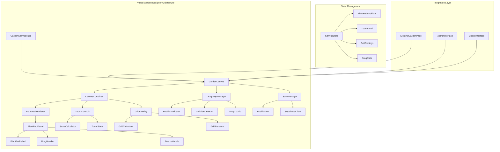
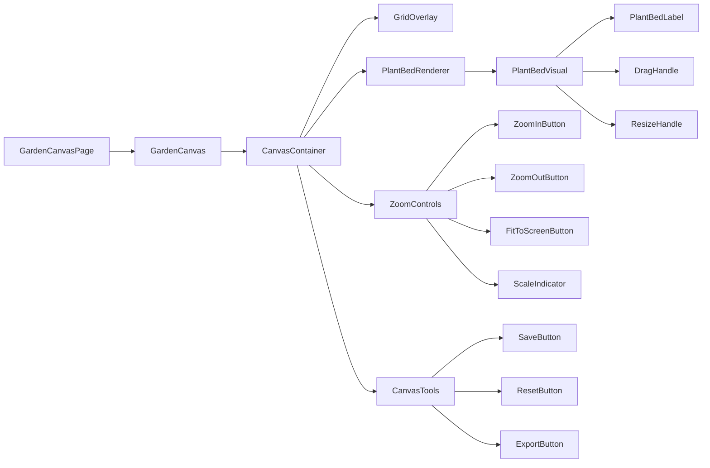
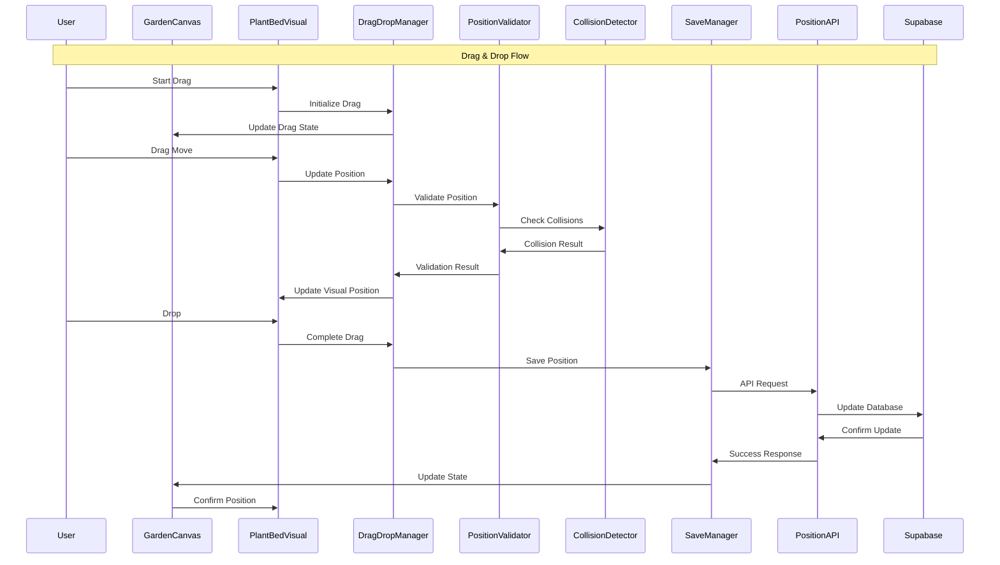
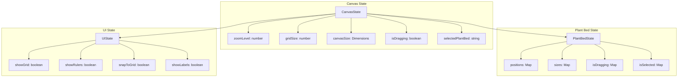

# 🎨 Visual Garden Designer - Architectuur Documentatie

## Overzicht

De Visual Garden Designer is een nieuwe functionaliteit die gebruikers in staat stelt om hun tuin visueel te ontwerpen en plantvakken interactief te beheren met drag & drop functionaliteit.

## 🏗️ Architectuur Componenten

### 1. Frontend Layer Architecture



### 2. Component Hierarchy



### 3. Data Flow Architecture



### 4. State Management



## 🔧 Technische Implementatie

### 1. Core Components

#### GardenCanvas Component
```typescript
interface GardenCanvasProps {
  gardenId: string;
  initialPlantBeds: PlantBedWithPosition[];
  canvasSize: Dimensions;
  onSave: (positions: PlantBedPosition[]) => void;
}

interface CanvasState {
  zoomLevel: number;
  gridSize: number;
  plantBedPositions: Map<string, Position>;
  isDragging: boolean;
  selectedPlantBed: string | null;
}
```

#### PlantBedVisual Component
```typescript
interface PlantBedVisualProps {
  plantBed: PlantBedWithPosition;
  position: Position;
  size: Size;
  scale: number;
  isDragging: boolean;
  isSelected: boolean;
  onDragStart: (id: string, position: Position) => void;
  onDragMove: (id: string, position: Position) => void;
  onDragEnd: (id: string, position: Position) => void;
}
```

#### DragDropManager Hook
```typescript
interface DragDropManager {
  isDragging: boolean;
  draggedElement: string | null;
  dragOffset: Position;
  startDrag: (elementId: string, position: Position) => void;
  updateDrag: (position: Position) => void;
  endDrag: () => void;
}
```

### 2. Database Schema Changes

```sql
-- Uitbreiding van plant_beds tabel
ALTER TABLE plant_beds ADD COLUMN IF NOT EXISTS position_x DECIMAL(10,2) DEFAULT 0;
ALTER TABLE plant_beds ADD COLUMN IF NOT EXISTS position_y DECIMAL(10,2) DEFAULT 0;
ALTER TABLE plant_beds ADD COLUMN IF NOT EXISTS visual_width DECIMAL(10,2) DEFAULT 1;
ALTER TABLE plant_beds ADD COLUMN IF NOT EXISTS visual_height DECIMAL(10,2) DEFAULT 1;
ALTER TABLE plant_beds ADD COLUMN IF NOT EXISTS rotation DECIMAL(5,2) DEFAULT 0;
ALTER TABLE plant_beds ADD COLUMN IF NOT EXISTS z_index INTEGER DEFAULT 0;

-- Uitbreiding van gardens tabel
ALTER TABLE gardens ADD COLUMN IF NOT EXISTS canvas_width DECIMAL(10,2) DEFAULT 20;
ALTER TABLE gardens ADD COLUMN IF NOT EXISTS canvas_height DECIMAL(10,2) DEFAULT 20;
ALTER TABLE gardens ADD COLUMN IF NOT EXISTS grid_size DECIMAL(10,2) DEFAULT 1;
ALTER TABLE gardens ADD COLUMN IF NOT EXISTS default_zoom DECIMAL(5,2) DEFAULT 1;

-- Indices voor performance
CREATE INDEX IF NOT EXISTS idx_plant_beds_position ON plant_beds(position_x, position_y);
CREATE INDEX IF NOT EXISTS idx_plant_beds_garden_position ON plant_beds(garden_id, position_x, position_y);
```

### 3. API Endpoints

#### Position Update API
```typescript
// POST /api/plant-beds/[id]/position
interface UpdatePositionRequest {
  position_x: number;
  position_y: number;
  visual_width?: number;
  visual_height?: number;
  rotation?: number;
  z_index?: number;
}

// POST /api/gardens/[id]/plant-beds/positions
interface BulkUpdatePositionsRequest {
  positions: Array<{
    id: string;
    position_x: number;
    position_y: number;
    visual_width?: number;
    visual_height?: number;
    rotation?: number;
    z_index?: number;
  }>;
}
```

#### Garden Configuration API
```typescript
// GET /api/gardens/[id]/canvas-config
interface CanvasConfig {
  canvas_width: number;
  canvas_height: number;
  grid_size: number;
  default_zoom: number;
}

// PUT /api/gardens/[id]/canvas-config
interface UpdateCanvasConfigRequest {
  canvas_width?: number;
  canvas_height?: number;
  grid_size?: number;
  default_zoom?: number;
}
```

### 4. Performance Optimizations

#### Virtualization Strategy
```typescript
// Alleen zichtbare plant beds renderen
const useVirtualizedPlantBeds = (
  plantBeds: PlantBedWithPosition[],
  viewportBounds: Bounds,
  scale: number
) => {
  return useMemo(() => {
    return plantBeds.filter(plantBed => {
      const scaledBounds = calculateScaledBounds(plantBed, scale);
      return boundsIntersect(scaledBounds, viewportBounds);
    });
  }, [plantBeds, viewportBounds, scale]);
};
```

#### Debounced Saving
```typescript
const useDebouncedSave = (
  positions: PlantBedPosition[],
  saveFunction: (positions: PlantBedPosition[]) => void,
  delay: number = 1000
) => {
  const debouncedSave = useMemo(
    () => debounce(saveFunction, delay),
    [saveFunction, delay]
  );
  
  useEffect(() => {
    debouncedSave(positions);
  }, [positions, debouncedSave]);
};
```

### 5. Collision Detection Algorithm

```typescript
interface CollisionDetector {
  checkCollision: (
    movingElement: PlantBedBounds,
    staticElements: PlantBedBounds[]
  ) => boolean;
  
  findNearestValidPosition: (
    desiredPosition: Position,
    elementSize: Size,
    obstacles: PlantBedBounds[],
    canvasBounds: Bounds
  ) => Position;
}

const useCollisionDetection = (): CollisionDetector => {
  const checkCollision = useCallback((moving, static) => {
    return static.some(element => 
      boundsOverlap(moving, element)
    );
  }, []);
  
  const findNearestValidPosition = useCallback((
    desiredPosition,
    elementSize,
    obstacles,
    canvasBounds
  ) => {
    // Spiral search voor dichtstbijzijnde geldige positie
    const gridSize = 0.5; // meters
    let radius = 0;
    
    while (radius < Math.max(canvasBounds.width, canvasBounds.height)) {
      const positions = generateSpiralPositions(
        desiredPosition,
        radius,
        gridSize
      );
      
      for (const position of positions) {
        const bounds = createBounds(position, elementSize);
        if (
          boundsWithinCanvas(bounds, canvasBounds) &&
          !checkCollision(bounds, obstacles)
        ) {
          return position;
        }
      }
      
      radius += gridSize;
    }
    
    return desiredPosition; // Fallback
  }, [checkCollision]);
  
  return { checkCollision, findNearestValidPosition };
};
```

## 🎨 UI/UX Design Patterns

### 1. Responsive Canvas Design

```css
.garden-canvas {
  /* Base styles */
  position: relative;
  overflow: hidden;
  background: linear-gradient(45deg, #f0f8ff 25%, transparent 25%),
              linear-gradient(-45deg, #f0f8ff 25%, transparent 25%),
              linear-gradient(45deg, transparent 75%, #f0f8ff 75%),
              linear-gradient(-45deg, transparent 75%, #f0f8ff 75%);
  background-size: 20px 20px;
  background-position: 0 0, 0 10px, 10px -10px, -10px 0px;
}

.garden-canvas-container {
  transform-origin: 0 0;
  transition: transform 0.3s ease;
}

.plant-bed-visual {
  position: absolute;
  border: 2px solid #22c55e;
  background: rgba(34, 197, 94, 0.1);
  border-radius: 8px;
  cursor: move;
  transition: all 0.2s ease;
}

.plant-bed-visual:hover {
  border-color: #16a34a;
  background: rgba(34, 197, 94, 0.2);
  transform: scale(1.02);
}

.plant-bed-visual.dragging {
  z-index: 1000;
  box-shadow: 0 8px 32px rgba(0, 0, 0, 0.3);
  transform: rotate(2deg) scale(1.05);
}
```

### 2. Touch-Friendly Design

```typescript
const useTouchGestures = (
  canvasRef: RefObject<HTMLElement>,
  onZoom: (scale: number) => void,
  onPan: (offset: Position) => void
) => {
  useEffect(() => {
    const canvas = canvasRef.current;
    if (!canvas) return;
    
    let initialDistance = 0;
    let initialScale = 1;
    let isPinching = false;
    
    const handleTouchStart = (e: TouchEvent) => {
      if (e.touches.length === 2) {
        isPinching = true;
        initialDistance = calculateDistance(e.touches[0], e.touches[1]);
        initialScale = getCurrentScale();
      }
    };
    
    const handleTouchMove = (e: TouchEvent) => {
      if (isPinching && e.touches.length === 2) {
        e.preventDefault();
        const currentDistance = calculateDistance(e.touches[0], e.touches[1]);
        const scale = initialScale * (currentDistance / initialDistance);
        onZoom(Math.max(0.1, Math.min(5, scale)));
      }
    };
    
    const handleTouchEnd = () => {
      isPinching = false;
    };
    
    canvas.addEventListener('touchstart', handleTouchStart);
    canvas.addEventListener('touchmove', handleTouchMove);
    canvas.addEventListener('touchend', handleTouchEnd);
    
    return () => {
      canvas.removeEventListener('touchstart', handleTouchStart);
      canvas.removeEventListener('touchmove', handleTouchMove);
      canvas.removeEventListener('touchend', handleTouchEnd);
    };
  }, [canvasRef, onZoom, onPan]);
};
```

## 🧪 Testing Strategy

### 1. Unit Tests

```typescript
describe('GardenCanvas', () => {
  it('should render plant beds at correct positions', () => {
    const plantBeds = [
      { id: '1', position_x: 5, position_y: 10, visual_width: 2, visual_height: 3 }
    ];
    
    render(<GardenCanvas plantBeds={plantBeds} />);
    
    const plantBedElement = screen.getByTestId('plant-bed-1');
    expect(plantBedElement).toHaveStyle({
      left: '5m',
      top: '10m',
      width: '2m',
      height: '3m'
    });
  });
  
  it('should handle drag and drop correctly', async () => {
    const onSave = jest.fn();
    const plantBeds = [
      { id: '1', position_x: 0, position_y: 0, visual_width: 2, visual_height: 2 }
    ];
    
    render(<GardenCanvas plantBeds={plantBeds} onSave={onSave} />);
    
    const plantBed = screen.getByTestId('plant-bed-1');
    
    fireEvent.mouseDown(plantBed, { clientX: 0, clientY: 0 });
    fireEvent.mouseMove(document, { clientX: 100, clientY: 100 });
    fireEvent.mouseUp(document);
    
    await waitFor(() => {
      expect(onSave).toHaveBeenCalledWith([
        { id: '1', position_x: 5, position_y: 5 } // 100px = 5m at 20px/m scale
      ]);
    });
  });
});
```

### 2. Integration Tests

```typescript
describe('Visual Garden Integration', () => {
  it('should save positions to database', async () => {
    const mockSupabase = createMockSupabaseClient();
    
    render(
      <SupabaseProvider value={mockSupabase}>
        <GardenCanvasPage gardenId="test-garden" />
      </SupabaseProvider>
    );
    
    // Simulate drag and drop
    const plantBed = screen.getByTestId('plant-bed-1');
    await userEvent.drag(plantBed, { delta: { x: 100, y: 100 } });
    
    // Verify database call
    expect(mockSupabase.from('plant_beds').update).toHaveBeenCalledWith({
      position_x: 5,
      position_y: 5
    });
  });
});
```

### 3. E2E Tests

```typescript
describe('Visual Garden E2E', () => {
  it('should allow user to design garden layout', async () => {
    await page.goto('/gardens/test-garden');
    
    // Switch to visual mode
    await page.click('[data-testid="visual-mode-toggle"]');
    
    // Drag plant bed
    await page.dragAndDrop(
      '[data-testid="plant-bed-1"]',
      '[data-testid="canvas-container"]',
      { targetPosition: { x: 200, y: 200 } }
    );
    
    // Verify position saved
    await page.waitForSelector('[data-testid="save-success"]');
    
    // Zoom in
    await page.click('[data-testid="zoom-in"]');
    
    // Verify zoom level
    const zoomLevel = await page.textContent('[data-testid="zoom-indicator"]');
    expect(zoomLevel).toBe('150%');
    
    // Verify layout persists after reload
    await page.reload();
    
    const plantBedPosition = await page.locator('[data-testid="plant-bed-1"]').boundingBox();
    expect(plantBedPosition.x).toBeCloseTo(200, 10);
    expect(plantBedPosition.y).toBeCloseTo(200, 10);
  });
});
```

## 🔒 Security Considerations

### 1. Input Validation

```typescript
const validatePosition = (position: Position): boolean => {
  return (
    typeof position.x === 'number' &&
    typeof position.y === 'number' &&
    position.x >= 0 &&
    position.y >= 0 &&
    position.x <= MAX_CANVAS_WIDTH &&
    position.y <= MAX_CANVAS_HEIGHT
  );
};

const validateSize = (size: Size): boolean => {
  return (
    typeof size.width === 'number' &&
    typeof size.height === 'number' &&
    size.width > 0 &&
    size.height > 0 &&
    size.width <= MAX_PLANT_BED_SIZE &&
    size.height <= MAX_PLANT_BED_SIZE
  );
};
```

### 2. Authorization Checks

```typescript
const useCanvasPermissions = (gardenId: string) => {
  const { user } = useAuth();
  
  const { data: permissions } = useQuery({
    queryKey: ['garden-permissions', gardenId, user?.id],
    queryFn: async () => {
      const { data } = await supabase
        .from('garden_permissions')
        .select('can_edit_layout')
        .eq('garden_id', gardenId)
        .eq('user_id', user?.id)
        .single();
      
      return data;
    },
    enabled: !!user?.id && !!gardenId
  });
  
  return {
    canEdit: permissions?.can_edit_layout ?? false,
    canView: !!permissions
  };
};
```

## 📊 Performance Metrics

### 1. Core Web Vitals Targets

- **LCP (Largest Contentful Paint)**: < 2.5s
- **FID (First Input Delay)**: < 100ms
- **CLS (Cumulative Layout Shift)**: < 0.1

### 2. Custom Metrics

- **Canvas Render Time**: < 16ms (60 FPS)
- **Drag Response Time**: < 50ms
- **Save Operation Time**: < 500ms
- **Zoom Operation Time**: < 100ms

### 3. Monitoring Implementation

```typescript
const usePerformanceMonitoring = () => {
  const measureCanvasRender = useCallback(() => {
    performance.mark('canvas-render-start');
    
    return () => {
      performance.mark('canvas-render-end');
      performance.measure(
        'canvas-render',
        'canvas-render-start',
        'canvas-render-end'
      );
    };
  }, []);
  
  const measureDragResponse = useCallback(() => {
    performance.mark('drag-response-start');
    
    return () => {
      performance.mark('drag-response-end');
      performance.measure(
        'drag-response',
        'drag-response-start',
        'drag-response-end'
      );
    };
  }, []);
  
  return { measureCanvasRender, measureDragResponse };
};
```

## 🚀 Deployment Considerations

### 1. Progressive Enhancement

```typescript
const useProgressiveEnhancement = () => {
  const [isEnhanced, setIsEnhanced] = useState(false);
  
  useEffect(() => {
    // Check for required features
    const hasRequiredFeatures = !!(
      window.requestAnimationFrame &&
      window.MouseEvent &&
      window.TouchEvent &&
      CSS.supports('transform', 'scale(1)')
    );
    
    setIsEnhanced(hasRequiredFeatures);
  }, []);
  
  return isEnhanced;
};
```

### 2. Graceful Degradation

```typescript
const GardenCanvas = ({ plantBeds, onSave }: GardenCanvasProps) => {
  const isEnhanced = useProgressiveEnhancement();
  
  if (!isEnhanced) {
    return (
      <div className="garden-fallback">
        <p>Visuele designer vereist een moderne browser.</p>
        <PlantBedList plantBeds={plantBeds} />
      </div>
    );
  }
  
  return <EnhancedGardenCanvas plantBeds={plantBeds} onSave={onSave} />;
};
```

---

Deze architectuur documentatie biedt een complete blauwdruk voor de implementatie van de Visual Garden Designer functionaliteit met focus op schaalbaarheid, performance en gebruiksvriendelijkheid.