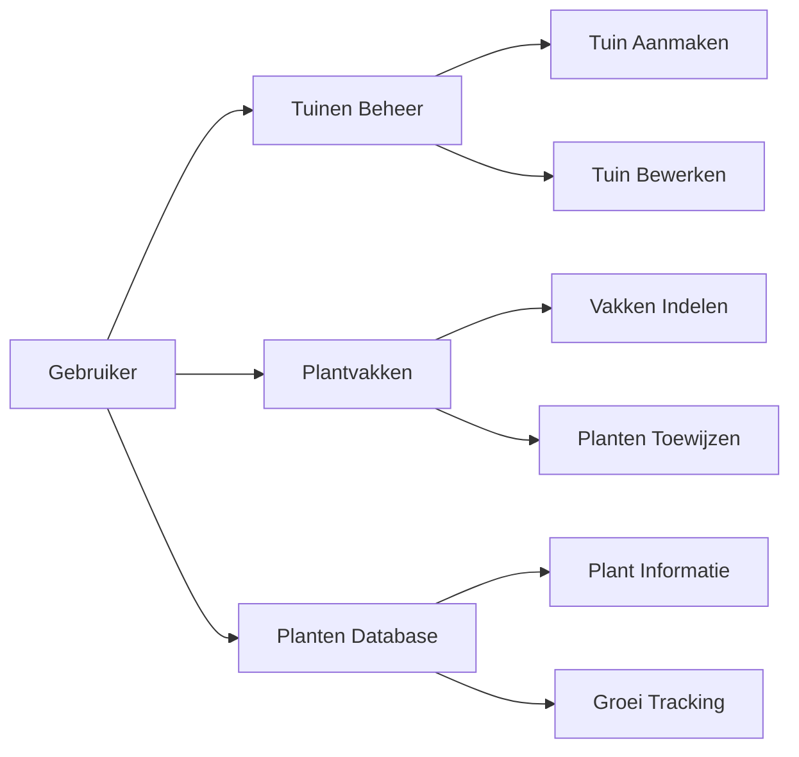

# 🎯 Functionele Documentatie

## Overzicht

Deze sectie beschrijft de functionele aspecten van het Tuinbeheer Systeem vanuit het perspectief van de eindgebruiker en bedrijfsprocessen.

## 📋 Inhoud

### [Systeembeschrijving](./system-description.md)
Een complete beschrijving van wat het systeem doet en voor wie het bedoeld is.

### [Gebruikershandleiding](./user-guide.md)
Stap-voor-stap instructies voor het gebruik van het systeem.

### [Functionaliteiten](./features.md)
Gedetailleerde beschrijving van alle beschikbare functies.

### [Workflows](./workflows.md)
Beschrijving van de belangrijkste bedrijfsprocessen en workflows.

## 🎯 Doelgroep

- **Tuinbeheerders**: Professionele gebruikers die tuinen beheren
- **Eigenaren**: Tuineigenaren die hun tuin willen bijhouden
- **Beheerders**: Systeembeheerders die het systeem configureren

## 🚀 Snelstart

1. Lees eerst de [Systeembeschrijving](./system-description.md)
2. Bekijk de [Gebruikershandleiding](./user-guide.md)
3. Verken de [Functionaliteiten](./features.md)

## 📊 Functionaliteiten Schema

