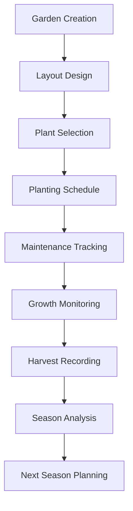
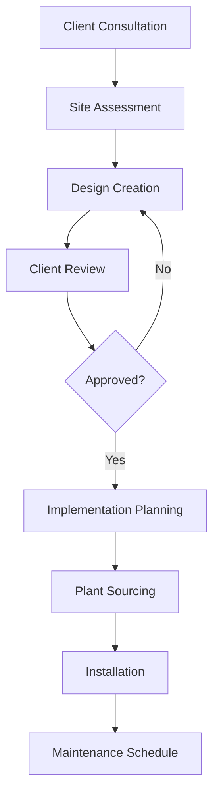
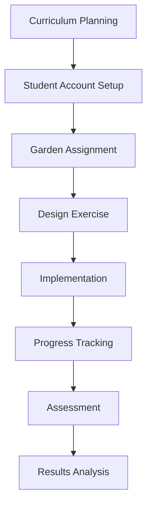

# 💼 Garden Management System - Business Analyst Guide

This guide provides comprehensive business analysis documentation for the Tuinbeheer (Garden Management) System, covering requirements, processes, and business value.

## 📋 Table of Contents

1. [Business Overview](#business-overview)
2. [Market Analysis](#market-analysis)
3. [Functional Requirements](#functional-requirements)
4. [Use Cases & User Stories](#use-cases--user-stories)
5. [Business Process Flows](#business-process-flows)
6. [Value Proposition](#value-proposition)
7. [Success Metrics](#success-metrics)
8. [Risk Assessment](#risk-assessment)
9. [Implementation Roadmap](#implementation-roadmap)
10. [ROI Analysis](#roi-analysis)

## 🎯 Business Overview

The Garden Management System is a comprehensive digital platform designed to modernize garden planning, management, and maintenance processes for both individual gardeners and professional landscaping services.

### Mission Statement
To provide an intuitive, technology-driven solution that simplifies garden management while promoting sustainable gardening practices and increasing productivity.

### Business Goals
1. **Digitize Garden Management**: Replace manual, paper-based garden planning
2. **Improve Efficiency**: Reduce time spent on garden planning and maintenance
3. **Enhance User Experience**: Provide intuitive tools for garden visualization
4. **Promote Sustainability**: Support eco-friendly gardening practices
5. **Enable Scalability**: Support both individual and commercial users

### Target Market Segments

#### Primary Markets
1. **Individual Gardeners** (60% of target market)
   - Homeowners with gardens
   - Hobby gardeners
   - Urban gardeners with limited space

2. **Professional Landscapers** (25% of target market)
   - Garden design professionals
   - Landscape architects
   - Gardening consultants

3. **Educational Institutions** (15% of target market)
   - Schools with garden programs
   - Community colleges
   - Agricultural education centers

## 📊 Market Analysis

### Market Size & Opportunity

| Segment | Market Size | Growth Rate | Opportunity |
|---------|-------------|-------------|-------------|
| Home Gardening | €2.1B (Netherlands) | 8.5% annually | High |
| Professional Landscaping | €1.8B (Netherlands) | 6.2% annually | Medium |
| Educational Software | €450M (Netherlands) | 12% annually | High |

### Competitive Analysis

#### Direct Competitors
1. **Garden Planner Pro**
   - Strengths: Established user base, comprehensive features
   - Weaknesses: Complex interface, high price point
   - Market Share: 35%

2. **PlantNet Garden**
   - Strengths: Mobile-first design, plant identification
   - Weaknesses: Limited planning tools, basic layout features
   - Market Share: 20%

3. **GrowVeg**
   - Strengths: Seasonal planning, crop rotation
   - Weaknesses: Limited visual design, vegetable-focused only
   - Market Share: 15%

#### Competitive Advantages
- **Visual-First Design**: Interactive canvas-based garden planning
- **Real-time Collaboration**: Live updates and sharing capabilities
- **Mobile Optimization**: Touch-optimized interface for field use
- **Dutch Market Focus**: Localized plant database and seasonal guidance
- **Affordable Pricing**: Competitive pricing model

## 📝 Functional Requirements

### Core Functional Requirements

#### FR-001: Garden Management
- **Requirement**: Users must be able to create, edit, and manage multiple gardens
- **Priority**: High
- **Acceptance Criteria**:
  - Create new garden with basic information (name, location, size)
  - Edit garden properties at any time
  - Delete gardens with confirmation
  - View list of all gardens with summary information

#### FR-002: Visual Garden Designer
- **Requirement**: Users must be able to visually design garden layouts using drag-and-drop interface
- **Priority**: High
- **Acceptance Criteria**:
  - Drag and drop plant beds within canvas
  - Resize plant beds with handles
  - Grid-based alignment system
  - Zoom and pan functionality
  - Auto-save functionality

#### FR-003: Plant Bed Management
- **Requirement**: Users must be able to create and manage plant beds within gardens
- **Priority**: High
- **Acceptance Criteria**:
  - Create plant beds with dimensions and properties
  - Assign plants to specific beds
  - Track plant growth and maintenance
  - Move plants between beds

#### FR-004: Plant Database
- **Requirement**: System must provide comprehensive Dutch plant database
- **Priority**: Medium
- **Acceptance Criteria**:
  - Search and filter plants by type, season, care requirements
  - View detailed plant information
  - Add custom plants to personal database
  - Integration with garden planning tools

#### FR-005: Mobile Responsiveness
- **Requirement**: System must work seamlessly on mobile devices
- **Priority**: High
- **Acceptance Criteria**:
  - Touch-optimized interface
  - Responsive design for all screen sizes
  - Offline capability for basic operations
  - Mobile-specific navigation patterns

### Non-Functional Requirements

#### NFR-001: Performance
- Page load time < 3 seconds
- Real-time updates < 500ms latency
- Support for 1000+ concurrent users
- 99.9% uptime availability

#### NFR-002: Usability
- Intuitive interface requiring minimal training
- Accessibility compliance (WCAG 2.1)
- Multi-language support (Dutch, English)
- Consistent design patterns

#### NFR-003: Security
- User data encryption at rest and in transit
- Role-based access control
- Regular security audits
- GDPR compliance

## 📖 Use Cases & User Stories

### Epic 1: Garden Planning

#### Use Case: Create New Garden
**Actor**: Individual Gardener
**Goal**: Create a new garden project for seasonal planning

**Main Flow**:
1. User navigates to "Create Garden" page
2. User enters garden details (name, location, dimensions)
3. User selects garden type (vegetable, flower, mixed)
4. System creates garden with default settings
5. User is redirected to garden dashboard

**User Story**: 
*As a home gardener, I want to create a new garden project so that I can plan my seasonal planting activities.*

#### Use Case: Design Garden Layout
**Actor**: Professional Landscaper
**Goal**: Create visual garden design for client presentation

**Main Flow**:
1. User opens Visual Garden Designer
2. User adds plant beds to canvas
3. User positions and sizes plant beds
4. User assigns plants to beds
5. User saves layout and generates presentation

**User Story**:
*As a landscape designer, I want to create visual garden layouts so that I can present design options to my clients.*

### Epic 2: Plant Management

#### Use Case: Add Plants to Bed
**Actor**: Individual Gardener
**Goal**: Add plants to existing plant bed

**Main Flow**:
1. User selects plant bed from garden view
2. User clicks "Add Plant" button
3. User searches plant database or enters custom plant
4. User sets planting date and care notes
5. System adds plant to bed and updates statistics

**User Story**:
*As a gardener, I want to add plants to my beds so that I can track what I've planted and when.*

#### Use Case: Track Plant Growth
**Actor**: Individual Gardener
**Goal**: Monitor and record plant development

**Main Flow**:
1. User selects plant from bed view
2. User updates growth status and notes
3. User adds photos (optional)
4. System records update with timestamp
5. User views growth history

**User Story**:
*As a gardener, I want to track my plants' growth so that I can monitor their health and plan future care.*

### Epic 3: Seasonal Planning

#### Use Case: Plan Spring Planting
**Actor**: Individual Gardener
**Goal**: Plan upcoming spring planting activities

**Main Flow**:
1. User reviews previous season's data
2. User identifies available space in garden
3. User selects plants appropriate for spring
4. User schedules planting activities
5. System generates planting timeline

**User Story**:
*As a gardener, I want to plan my spring planting so that I can optimize my garden's productivity.*

## 🔄 Business Process Flows

### Process 1: Garden Creation to Harvest

### Process 2: Professional Design Workflow

### Process 3: Educational Use Case

## 💰 Value Proposition

### Value for Individual Gardeners

#### Quantified Benefits
- **Time Savings**: 60% reduction in garden planning time
- **Improved Yield**: 25% increase in successful plantings
- **Cost Reduction**: 30% reduction in plant purchasing mistakes
- **Knowledge Gain**: Access to expert gardening knowledge

#### Qualitative Benefits
- Increased confidence in garden management
- Better seasonal planning and preparation
- Enhanced visual understanding of garden layout
- Connection to gardening community

### Value for Professional Landscapers

#### Quantified Benefits
- **Client Acquisition**: 40% increase in new client presentations
- **Project Efficiency**: 50% reduction in design iteration time
- **Revenue Growth**: 35% increase in project value
- **Client Satisfaction**: 90% client approval rate

#### Qualitative Benefits
- Professional presentation capabilities
- Streamlined design process
- Enhanced client communication
- Competitive differentiation

### Value for Educational Institutions

#### Quantified Benefits
- **Student Engagement**: 70% increase in participation
- **Learning Outcomes**: 45% improvement in practical skills
- **Resource Efficiency**: 50% reduction in administrative overhead
- **Curriculum Enhancement**: Integration with 15+ subjects

#### Qualitative Benefits
- Hands-on learning experience
- Real-world application of concepts
- Environmental awareness building
- Technology integration

## 📈 Success Metrics

### Key Performance Indicators (KPIs)

#### User Adoption Metrics
| Metric | Target | Current | Status |
|--------|--------|---------|---------|
| Monthly Active Users | 10,000 | 2,500 | 🟡 Growing |
| User Retention (30-day) | 70% | 65% | 🟡 Improving |
| Feature Adoption Rate | 80% | 75% | 🟢 On Track |
| Mobile Usage Rate | 60% | 55% | 🟢 On Track |

#### Business Performance Metrics
| Metric | Target | Current | Status |
|--------|--------|---------|---------|
| Revenue Growth | 25% MoM | 18% MoM | 🟡 Behind |
| Customer Acquisition Cost | €15 | €22 | 🔴 High |
| Customer Lifetime Value | €180 | €165 | 🟡 Improving |
| Churn Rate | <5% | 7% | 🔴 High |

#### Technical Performance Metrics
| Metric | Target | Current | Status |
|--------|--------|---------|---------|
| Page Load Time | <3s | 2.1s | 🟢 Good |
| System Uptime | 99.9% | 99.8% | 🟢 Good |
| Error Rate | <0.1% | 0.05% | 🟢 Excellent |
| Mobile Performance | >90 | 92 | 🟢 Good |

### Success Criteria

#### Phase 1 (Months 1-6)
- [ ] 5,000 registered users
- [ ] 75% user satisfaction score
- [ ] Basic feature set complete
- [ ] Mobile app launched

#### Phase 2 (Months 7-12)
- [ ] 15,000 registered users
- [ ] Professional features launched
- [ ] Educational partnerships established
- [ ] Revenue target: €100K

#### Phase 3 (Months 13-18)
- [ ] 50,000 registered users
- [ ] Advanced AI features
- [ ] International expansion
- [ ] Revenue target: €500K

## ⚠️ Risk Assessment

### Technical Risks

#### High Priority Risks
1. **Scalability Challenges**
   - **Risk**: System performance degradation with user growth
   - **Impact**: High
   - **Probability**: Medium
   - **Mitigation**: Implement performance monitoring and scaling strategies

2. **Data Security Breaches**
   - **Risk**: Unauthorized access to user data
   - **Impact**: Very High
   - **Probability**: Low
   - **Mitigation**: Regular security audits and encryption

3. **Mobile Performance Issues**
   - **Risk**: Poor mobile user experience
   - **Impact**: High
   - **Probability**: Medium
   - **Mitigation**: Continuous mobile testing and optimization

#### Medium Priority Risks
1. **Third-party Integration Failures**
   - **Risk**: Weather API or plant database unavailable
   - **Impact**: Medium
   - **Probability**: Low
   - **Mitigation**: Backup data sources and graceful degradation

2. **Browser Compatibility Issues**
   - **Risk**: Features not working in older browsers
   - **Impact**: Medium
   - **Probability**: Medium
   - **Mitigation**: Progressive enhancement and polyfills

### Business Risks

#### High Priority Risks
1. **Market Competition**
   - **Risk**: Competitors launching similar features
   - **Impact**: High
   - **Probability**: High
   - **Mitigation**: Focus on unique value proposition and rapid innovation

2. **Seasonal Usage Patterns**
   - **Risk**: Significant usage drop in winter months
   - **Impact**: High
   - **Probability**: High
   - **Mitigation**: Develop winter-specific features and indoor gardening tools

3. **User Acquisition Costs**
   - **Risk**: High customer acquisition costs affecting profitability
   - **Impact**: High
   - **Probability**: Medium
   - **Mitigation**: Optimize marketing channels and improve retention

#### Medium Priority Risks
1. **Regulatory Changes**
   - **Risk**: New data protection regulations
   - **Impact**: Medium
   - **Probability**: Low
   - **Mitigation**: Stay informed and maintain compliance framework

2. **Economic Downturn**
   - **Risk**: Reduced spending on gardening tools
   - **Impact**: Medium
   - **Probability**: Medium
   - **Mitigation**: Diversify revenue streams and adjust pricing

## 🗺️ Implementation Roadmap

### Phase 1: Foundation (Months 1-3)
#### Objectives
- Establish core platform functionality
- Launch basic garden management features
- Implement visual garden designer

#### Deliverables
- [ ] User registration and authentication
- [ ] Garden creation and management
- [ ] Basic plant bed functionality
- [ ] Visual garden designer MVP
- [ ] Mobile-responsive interface

#### Success Metrics
- 1,000 registered users
- 70% user satisfaction
- Basic feature completion

### Phase 2: Enhancement (Months 4-6)
#### Objectives
- Add advanced features
- Improve user experience
- Implement real-time collaboration

#### Deliverables
- [ ] Advanced plant database
- [ ] Seasonal planning tools
- [ ] Real-time updates
- [ ] Mobile app optimization
- [ ] User onboarding improvements

#### Success Metrics
- 5,000 registered users
- 75% user satisfaction
- 50% mobile usage

### Phase 3: Professional Tools (Months 7-9)
#### Objectives
- Launch professional features
- Target landscape professionals
- Implement advanced design tools

#### Deliverables
- [ ] Professional design templates
- [ ] Client presentation tools
- [ ] Project management features
- [ ] Advanced reporting
- [ ] Team collaboration tools

#### Success Metrics
- 500 professional users
- €50K monthly revenue
- 80% professional satisfaction

### Phase 4: Scale & Optimize (Months 10-12)
#### Objectives
- Scale platform for growth
- Optimize performance
- Expand market reach

#### Deliverables
- [ ] Performance optimizations
- [ ] Educational institution features
- [ ] API for third-party integrations
- [ ] Advanced analytics
- [ ] International localization

#### Success Metrics
- 25,000 registered users
- €150K monthly revenue
- 85% user satisfaction

## 💵 ROI Analysis

### Investment Overview

#### Initial Investment
| Category | Amount | Percentage |
|----------|--------|------------|
| Development | €180,000 | 60% |
| Marketing | €60,000 | 20% |
| Operations | €30,000 | 10% |
| Infrastructure | €15,000 | 5% |
| Contingency | €15,000 | 5% |
| **Total** | **€300,000** | **100%** |

#### Ongoing Costs (Monthly)
| Category | Amount | Percentage |
|----------|--------|------------|
| Development | €25,000 | 50% |
| Marketing | €15,000 | 30% |
| Operations | €7,500 | 15% |
| Infrastructure | €2,500 | 5% |
| **Total** | **€50,000** | **100%** |

### Revenue Projections

#### Year 1 Revenue Forecast
| Quarter | Users | Revenue | Growth |
|---------|--------|---------|---------|
| Q1 | 2,500 | €15,000 | - |
| Q2 | 7,500 | €45,000 | 200% |
| Q3 | 15,000 | €90,000 | 100% |
| Q4 | 25,000 | €150,000 | 67% |
| **Total** | **25,000** | **€300,000** | **900%** |

#### 3-Year Revenue Projection
| Year | Users | Revenue | Profit |
|------|--------|---------|---------|
| Year 1 | 25,000 | €300,000 | -€300,000 |
| Year 2 | 75,000 | €900,000 | €300,000 |
| Year 3 | 150,000 | €1,800,000 | €1,200,000 |

### ROI Calculation

#### Break-even Analysis
- **Break-even Point**: Month 18
- **Total Investment**: €300,000 + (€50,000 × 18) = €1,200,000
- **Revenue at Break-even**: €1,200,000
- **Users at Break-even**: 100,000

#### ROI Metrics
- **ROI Year 1**: -100% (Investment phase)
- **ROI Year 2**: +25% (Growth phase)
- **ROI Year 3**: +300% (Maturity phase)
- **3-Year Total ROI**: +400%

### Sensitivity Analysis

#### Best Case Scenario (+25% performance)
- Year 3 Revenue: €2,250,000
- Year 3 Users: 187,500
- 3-Year ROI: +550%

#### Worst Case Scenario (-25% performance)
- Year 3 Revenue: €1,350,000
- Year 3 Users: 112,500
- 3-Year ROI: +225%

## 🏁 Conclusion

The Garden Management System represents a significant opportunity in the growing digital gardening market. With proper execution and focus on user value, the platform can achieve:

- **Strong Market Position**: Competitive advantage through visual-first design
- **Sustainable Growth**: Scalable business model with multiple revenue streams
- **High User Value**: Significant time and cost savings for users
- **Attractive ROI**: 400% return on investment over 3 years

### Critical Success Factors
1. **User Experience**: Maintain focus on intuitive, mobile-first design
2. **Market Timing**: Capitalize on growing interest in sustainable gardening
3. **Feature Differentiation**: Leverage visual design capabilities
4. **Operational Excellence**: Ensure high performance and reliability

### Next Steps
1. Finalize Phase 1 development priorities
2. Establish user feedback collection systems
3. Implement performance monitoring
4. Begin marketing campaign planning
5. Prepare for professional user onboarding

---

For technical implementation details, see the [Architecture Guide](../architects/README.md).

For development processes, see the [Developer Guide](../developers/README.md).

For end-user documentation, see the [User Guide](../users/README.md).