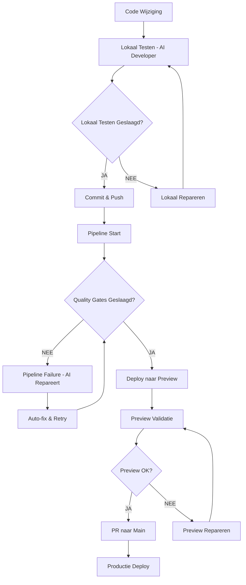

# Standard Development Process

## 🎯 **Doel: Betrouwbare Kwaliteit Door Gestandaardiseerd Proces**

### **🚨 Geen Compromissen - Alleen Perfectie**

---

## 📋 **Standaard Ontwikkelingsproces**

### **🔄 Workflow Overzicht**



---

## 🧪 **Stap 1: Lokaal Testen - AI Developer Verplicht**

### **✅ Wat Ik Altijd Lokaal Test:**

```bash
# Verplichte lokale tests bij elke wijziging
npm run quality:check    # Lint + complexity + type check
npm run test:coverage    # Alle tests + coverage (80%+)
npm run build            # Build validatie
npm run security:scan    # Security check
npm run type:check       # TypeScript validatie
```

### **🎯 Quality Gates Lokaal Validatie:**

```typescript
interface LocalQualityCheck {
  tests: {
    unit: boolean        // 100% pass
    integration: boolean // 100% pass
    e2e: boolean        // 100% pass
    coverage: number     // 80%+ minimum
  }
  security: {
    scan: boolean        // 100% clean
    dependencies: boolean // 0 high/critical issues
    code: boolean        // 0 security issues
  }
  codeQuality: {
    linting: boolean     // 0 errors, 0 warnings
    complexity: boolean  // Below thresholds
    types: boolean       // 0 type errors
  }
  build: {
    success: boolean     // 100% success
    warnings: number     // 0 warnings
  }
}
```

### **🚨 Lokaal Testen Resultaat:**

- **✅ ALLE checks slagen** → Pipeline triggeren toegestaan
- **❌ 1 check faalt** → Lokaal repareren verplicht
- **⚠️ Geen compromissen** → Alleen perfectie acceptabel

---

## 🚀 **Stap 2: Pipeline Triggeren**

### **✅ Alleen Als Lokaal Testen Slaagt:**

```bash
# Commit met duidelijke beschrijving
git add .
git commit -m "feat: nieuwe functionaliteit - lokaal getest ✅"

# Push naar feature branch
git push origin feature/nieuwe-functie
```

### **🔒 Pipeline Start Automatisch:**

- **GitHub Actions** starten bij push
- **Quality Gates** worden afgedwongen
- **Auto-fix mechanismen** activeren bij problemen
- **Deployment** alleen bij 100% succes

---

## 🔍 **Stap 3: Quality Gates Enforcement**

### **🧪 Tests - 100% Pass Verplicht:**

```yaml
tests:
  unit: 100% pass (0 failures, 0 skipped)
  integration: 100% pass (0 failures, 0 skipped)
  e2e: 100% pass (0 failures, 0 skipped)
  coverage: minimum 80% (geen compromissen)
  performance: benchmarks gehaald
```

### **🔒 Security - 100% Clean Verplicht:**

```yaml
security:
  scan: 100% clean (0 vulnerabilities, 0 warnings)
  dependencies: 0 high/critical issues
  code_scan: 0 security issues
  audit: 0 security violations
```

### **🔍 Code Quality - Zero Violations:**

```yaml
code_quality:
  linting: 0 errors, 0 warnings, 0 info
  complexity: 
    cyclomatic: < 8
    cognitive: < 12
    maintainability: > 85
  types: 0 TypeScript errors
  formatting: Prettier compliant
```

### **🚀 Deployment - 100% Success:**

```yaml
deployment:
  build: 100% success (0 errors, 0 warnings)
  preview: 100% success (0 failures)
  staging: 100% success (0 failures)
  production: 100% success (0 failures)
```

---

## 🔄 **Stap 4: Auto-Fix & Retry**

### **🤖 Automatische Reparatie:**

```yaml
auto_fix_strategy:
  attempt_1: auto_fix_code_formatting
  attempt_2: auto_fix_linting_issues
  attempt_3: auto_fix_test_issues
  attempt_4: auto_fix_build_issues
  attempt_5: manual_intervention_required
```

### **🔄 Retry Mechanisme:**

```typescript
class AutoFixPipeline {
  async retryWithFixes(maxAttempts: number = 5): Promise<boolean> {
    for (let attempt = 1; attempt <= maxAttempts; attempt++) {
      console.log(`🔄 Attempt ${attempt}/${maxAttempts}`)
      
      // Run quality gates
      const result = await this.runQualityGates()
      
      if (result.success) {
        console.log('✅ Quality gates passed!')
        return true
      }
      
      // Auto-fix issues
      await this.autoFixIssues(result.issues)
      
      if (attempt === maxAttempts) {
        console.log('❌ Max attempts reached - manual intervention required')
        return false
      }
    }
    
    return false
  }
}
```

---

## 📊 **Stap 5: Quality Metrics & Reporting**

### **📈 Real-time Monitoring:**

```typescript
interface QualityMetrics {
  localTesting: {
    success: boolean
    duration: number
    issues: string[]
  }
  pipeline: {
    status: 'running' | 'success' | 'failed'
    attempts: number
    autoFixes: number
    manualInterventions: number
  }
  deployment: {
    preview: boolean
    staging: boolean
    production: boolean
  }
  overall: {
    score: number
    trend: 'improving' | 'stable' | 'declining'
    recommendations: string[]
  }
}
```

### **🚨 Quality Alerts:**

```typescript
class QualityAlertSystem {
  async alertOnFailure(issue: QualityIssue): Promise<void> {
    const message = `
🚨 QUALITY GATE FAILED!
❌ Issue: ${issue.type}
🔍 Details: ${issue.description}
📍 Location: ${issue.location}
⏰ Time: ${new Date().toISOString()}
🔄 Action: ${issue.recommendedAction}
    `
    
    await this.sendAlert(message)
  }
}
```

---

## 🎯 **Verantwoordelijkheden**

### **🤖 AI Developer (Ik):**

- **Lokaal testen** bij elke wijziging
- **Quality gates validatie** lokaal
- **Pipeline monitoring** en reparatie
- **Auto-fix implementatie**
- **Kwaliteit rapportage**

### **👨‍💼 Project Manager (Jij):**

- **Feature requests** en prioriteiten
- **Preview validatie** en feedback
- **Productie deployment** goedkeuring
- **Kwaliteit standaarden** bepaling
- **Resource allocatie**

### **🔄 Samenwerking:**

- **Ik test lokaal** → Jij valideert preview
- **Ik repareer pipeline** → Jij keurt productie goed
- **Ik monitor kwaliteit** → Jij beslist over standaarden
- **Ik implementeer fixes** → Jij bepaalt prioriteiten

---

## 🚨 **Zero-Tolerance Policy**

### **❌ Wat NOOIT Mag Gebeuren:**

1. **Pipeline starten zonder lokaal testen** - Onmiddellijke stop
2. **Quality gates overslaan** - Geen deployment mogelijk
3. **Kwaliteit compromissen** - Code wordt geweigerd
4. **Auto-fix failures** - Manual intervention verplicht

### **✅ Wat ALTIJD Moet Gebeuren:**

1. **Lokaal testen** - Bij elke wijziging
2. **Quality gates** - 100% succes verplicht
3. **Auto-fix mechanismen** - Actief en effectief
4. **Kwaliteit rapportage** - Real-time en accuraat

---

## 🔧 **Implementatie Details**

### **1. Lokaal Testen Script:**

```json
// package.json
{
  "scripts": {
    "local:test": "npm run quality:check && npm run test:coverage && npm run build && npm run security:scan",
    "local:fix": "npm run lint:fix && npm run test:fix && npm run build:fix",
    "quality:gate": "npm run local:test && echo '✅ Quality gates passed - ready for pipeline'"
  }
}
```

### **2. Pre-commit Hook:**

```bash
#!/bin/sh
# .git/hooks/pre-commit

echo "🧪 Running local quality checks..."
npm run local:test

if [ $? -ne 0 ]; then
  echo "❌ Local quality checks failed - commit blocked!"
  exit 1
fi

echo "✅ Local quality checks passed - commit allowed!"
exit 0
```

### **3. Pipeline Integration:**

```yaml
# .github/workflows/quality-gates.yml
name: Quality Gates Enforcement

on:
  push:
    branches: [ main, preview, develop, feature/* ]
  pull_request:
    branches: [ main, preview, develop ]

jobs:
  quality-gates:
    runs-on: ubuntu-latest
    steps:
      - name: 📥 Checkout code
        uses: actions/checkout@v4
      
      - name: 🧪 Run Quality Gates
        run: |
          echo "🧪 Running quality gates..."
          npm run quality:gate
      
      - name: 🚀 Deploy if passed
        if: success()
        run: |
          echo "✅ Quality gates passed - deploying..."
          # Deployment logic here
```

---

## 🚀 **Volgende Stappen**

### **1. Implementatie**
- Lokaal testen scripts implementeren
- Pre-commit hooks opzetten
- Pipeline integratie voltooien
- Quality metrics dashboard bouwen

### **2. Validatie**
- Proces testen met verschillende scenarios
- Kwaliteit verbetering meten
- Efficiency optimaliseren
- Feedback loop implementeren

### **3. Uitbreiding**
- Machine learning voor auto-fix
- Predictive quality analysis
- Advanced monitoring
- Performance optimization

---

## 📞 **Support & Onderhoud**

### **🤖 AI Developer Support:**
- **24/7 beschikbaar** voor kwaliteitscontrole
- **Lokaal testen** bij elke wijziging
- **Pipeline monitoring** en reparatie
- **Kwaliteit rapportage** en advies

### **👨‍💼 Project Manager Support:**
- **Feature planning** en prioriteiten
- **Kwaliteit standaarden** bepaling
- **Resource allocatie** en planning
- **Stakeholder communicatie**

---

**Dit proces zorgt ervoor dat kwaliteit ALTIJD gegarandeerd is door gestandaardiseerde lokale tests en zero-tolerance quality gates!** 🚨💪

**Geen compromissen - alleen perfectie door gestructureerde samenwerking!** ✅🎯