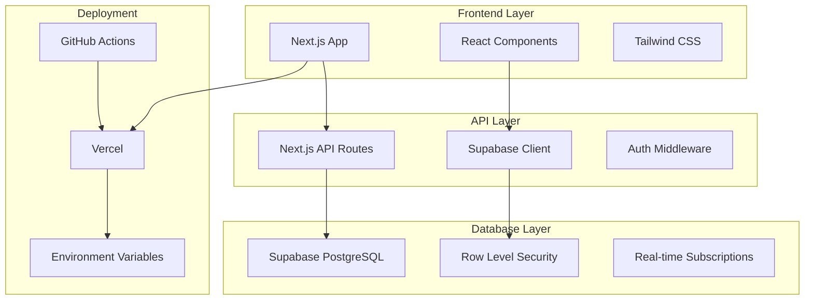
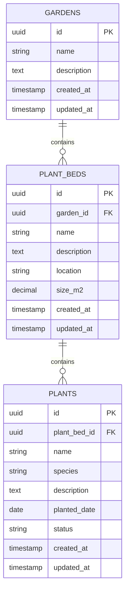

# 🔧 Technische Documentatie

## Overzicht

Deze sectie beschrijft de technische aspecten van het Tuinbeheer Systeem voor ontwikkelaars en technische implementatie.

## 📋 Inhoud

### [Architectuur Overzicht](./architecture-overview.md)
Technische architectuur van het systeem, tech stack en componenten.

### [Database Schema](./database-schema.md)
Complete database structuur, relaties en constraints.

### [API Documentatie](./api-documentation.md)
REST API endpoints, requests/responses en authenticatie.

### [Ontwikkelaar Gids](./developer-guide.md)
Setup, development workflow en best practices.

## 🛠️ Tech Stack

### Frontend
- **Framework**: Next.js 14.2.16
- **Styling**: Tailwind CSS
- **UI Components**: shadcn/ui
- **Language**: TypeScript

### Backend
- **Database**: Supabase (PostgreSQL)
- **Authentication**: Supabase Auth
- **API**: Next.js API Routes
- **Real-time**: Supabase Realtime

### Deployment
- **Hosting**: Vercel
- **CI/CD**: GitHub Actions
- **Environments**: Test & Production

## 🏗️ Architectuur Schema

## 🚀 Quick Start voor Ontwikkelaars

1. **Setup**: [Lokale Development](../setup/local-development.md)
2. **Database**: [Database Setup](../setup/database-setup.md)
3. **API**: [API Documentatie](./api-documentation.md)
4. **Deployment**: [Deployment Guide](../deployment/deployment-guide.md)

## 📊 Database Schema Overzicht

## 🔐 Beveiliging

- **Authentication**: Supabase Auth met JWT
- **Authorization**: Row Level Security (RLS)
- **Environment Variables**: Vercel Environment Variables
- **HTTPS**: Vercel SSL/TLS